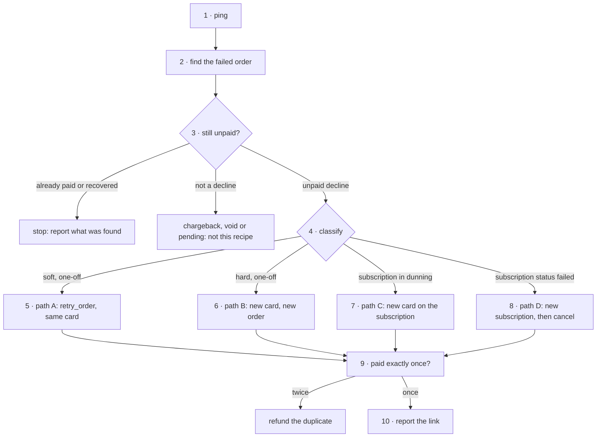

# Failed payment recovery

**Policy:** [`SAFETY.md`](../SAFETY.md) · **Safety layer:**
[`epd-mcp-operator`](../docs/epd-mcp-operator.md) · **Index:** [recipes](./README.md)

A payment failed. This chain ends it in one of three states: **recovered** — the
customer paid once, and the failed record is tied to the payment that replaced
it; **waiting on the customer** for a new card; or **closed by decision**. It
never ends in "retried until something worked", and never in a second charge.

The chain has one hard rule, and the sandbox run is why: **check that the
failure is still unpaid before recovering it.** A recovery creates a new order
and leaves the failed one reading `failed` for good, with nothing on either
order pointing at the other. The next person to look sees an unpaid failure.
And `retry_failed_charge`, called again on the same failed transaction under a
new key, charged the customer a second time.

## Outcome

- The failure was classified before anything moved, and the class is on record.
- If recovered: exactly one succeeded order pays for the failed one, and the
  link between them is in the report — and, for a one-off order, on the
  replacement order's `metadata`.
- If it is a subscription: the subscription is billing again, or cancelled by a
  human decision — not left `failed`, and not left with a retry nobody expected.
- If the customer was charged twice anyway, the duplicate is refunded.

**Not in this recipe.** Chargebacks, voids and pending charges are not declines;
step 3 routes them away. Writing retry logic into the merchant's own backend is
[`epd-best-practices`](../docs/epd-best-practices.md).

## Before you start

| Input | Why it matters |
|---|---|
| A handle on the failure: the order UUID, a transaction UUID, or the customer's email | `get_order` takes a UUID only. An `order_number` from a receipt has **no lookup** on this surface. |
| Whether the human wants a retry now or is content to wait | Decides the path at step 4. Nothing here retries to find out. |
| For a new card: how it arrives — a browser with EPD Elements, or headless | Picks `add_payment_method` or `secure.epd.com` ([rule 8](../SAFETY.md#8-raw-card-data-never-touches-the-mcp-surface)). |

## The chain



| # | Step | Skill | Tools | Tier | Checkpoint |
|---|---|---|---|---|---|
| 1 | Establish the mode | operator | `ping` | T0 | mode stated |
| 2 | Find the failed order | triage | `list_customers`, `list_orders`, `get_order` | T0 | one order, read with its transactions |
| 3 | Check it is still unpaid | triage | `list_orders` | T0 | no succeeded sale, no later recovery, and a decline |
| 4 | Classify and pick a path | triage, subscriptions | `get_subscription` | T0 | class, reason and path agreed with the human |
| 5 | Path A — same card | catalog | `retry_order` | T3 | `status: "succeeded"` |
| 6 | Path B — new card, one-off | onboard, catalog | `list_payment_methods`, `create_order` | T2 | new order succeeded, linked by `metadata` |
| 7 | Path C — new card, dunning | onboard, subscriptions | `update_subscription`, `get_subscription` | T2 | subscription bills the new card |
| 8 | Path D — first charge failed | subscriptions | `create_subscription`, `cancel_subscription` | T3 | new subscription active, failed one cancelled |
| 9 | Paid exactly once | triage, subscriptions, refunds | `list_orders`, `get_subscription`, `refund_order` | T0, T3 | one succeeded payment for the failure |
| 10 | Report | — | — | — | the failed-to-recovered mapping is written down |

## Steps

### 1. Establish the mode

**Skill:** [`epd-mcp-operator`](../docs/epd-mcp-operator.md) · **Tier:** T0

```
tool: ping
input: {}
```

**Checkpoint.** `environment` and `is_sandbox` agree, and the mode is stated
before step 5. Recovery in live mode moves real money on a card that already
failed once.

**If it fails**

| Condition | What it means | Do |
|---|---|---|
| The two fields disagree | Not where you think you are | Stop. |
| HTTP 403 `insufficient_permissions` | A restricted key | A full-access key is needed. |

### 2. Find the failed order

**Skill:** [`epd-transaction-triage`](../docs/epd-transaction-triage.md) · **Tier:** T0

From an order UUID, go straight to `get_order`. From a transaction UUID,
`get_transaction` gives the `order_id`. From an email — or when all the human has
is an order number, which has no lookup — find the customer first:

```
tool: list_customers
input:
  email: <human: customer email>
  limit: 10
```

```
tool: list_orders
input:
  customer_id: <step 2: customer.id>
  status: failed
  sort: created_at[desc]
  limit: 20
```

An `order_number` the customer quoted can be matched within that one customer's
orders. Paging the whole account for it is guessing, and spends the rate limit.

```
tool: get_order
input:
  id: <step 2: failed order.id>
  expand: transactions
```

**Checkpoint.** One order, identified by UUID, with its `status`, `total`,
`currency`, `failure_code`, `attempt_count`, `next_retry_at`, `subscription_id`
and every transaction quoted from this response.

**If it fails**

| Condition | What it means | Do |
|---|---|---|
| `invalid_order_id` | An order number was passed as an ID | Find the customer instead. |
| Several failed orders | The human's handle is ambiguous | List them — date, amount, number — and ask which. |
| No failed order, but the human insists | The failure may be a transaction on an order that later succeeded | Go on to step 3; it answers exactly this. |

### 3. Check it is still unpaid

**Skill:** [`epd-transaction-triage`](../docs/epd-transaction-triage.md) · **Tier:** T0

Three questions, all answered by reads. Any "no" ends the chain here.

**Was money taken on this order?** Look for a `sale` transaction with
`status: "succeeded"` in step 2's `transactions`. Do not settle it from the
order's `status` alone — it can point either way. An order that failed and then
succeeded on `retry_order` reads `succeeded` above its failed row. And both
subscription cycle orders in dunning on the sandbox read `succeeded` while every
one of their sale transactions had failed. If the order's status and its
transactions disagree, report both and stop.

**Was it already recovered by a new order?** Recovery onto a new card creates a
new order and leaves this one `failed`. Look at the customer's later orders:

```
tool: list_orders
input:
  customer_id: <step 2: failed order.customer_id>
  created_after: <step 2: failed order.created_at>
  status: succeeded,partially_refunded,refunded
  limit: 20
```

A row with `metadata.recovers_order` equal to this order's id is a recovery made
by path B. A row with the same items and total, made after the failure, may be
one made by `retry_failed_charge`, which records no link — ask the human before
treating it as either.

**Is it a decline at all?** A transaction `status` of `chargeback`, `voided` or
`pending` is not a decline. A chargeback is a dispute on money that arrived;
pending means wait.

**Checkpoint.** All three stated: no succeeded sale, no later recovery, and a
`failed` decline.

**If it fails**

| Condition | What it means | Do |
|---|---|---|
| A sale succeeded | The customer paid | Stop. Report the order and transaction, and that nothing is owed. |
| A later order looks like the recovery | Someone recovered it already | Stop. Recovering again is the double charge this step exists to prevent. |
| `chargeback`, `voided` or `pending` | Not a decline | Stop and route: a dispute is not retried. |
| Status and transactions disagree | The data contradicts itself | Report both and escalate with the `request_id`. |

### 4. Classify the failure and pick a path

**Skill:** [`epd-transaction-triage`](../docs/epd-transaction-triage.md), plus
[`epd-subscriptions`](../docs/epd-subscriptions.md) when `subscription_id` is set ·
**Tier:** T0

If the order has a `subscription_id`, read the subscription — its status decides
between paths C and D:

```
tool: get_subscription
input:
  id: <step 2: failed order.subscription_id>
  expand: cycles
```

Then choose with the human:

| Situation | Class | Path |
|---|---|---|
| One-off, `insufficient_funds`, `issuer_unavailable`, `card_limit_exceeded` | soft | **A** if the human wants a retry now. Nothing will retry it otherwise: `next_retry_at` is `null` on all 593 failed one-off orders on the sandbox. |
| One-off, `do_not_honor` or `processor_declined`, first time | ambiguous | **A**, once, later. The same code again means a new card. |
| One-off, `expired_card`, `transaction_not_allowed`, `incorrect_cvv` | hard | **B**. The same card fails the same way. |
| `lost_stolen_card`, anywhere | hard | **B** or **C**, and the old card is never retried by any route. |
| Subscription `active` with `attempt_count > 0` and `next_retry_at` set — on the **subscription** | dunning | **C**. Soft codes can simply wait for `next_retry_at`. |
| Subscription `status: "failed"`, `cycles: []` | first charge failed | **D**, whatever the code. |

**Checkpoint.** The class, the reason in words — "`do_not_honor`: the issuer
refused and gave no reason" — and the chosen path, agreed by the human. Money
moves from the next step on.

**If it fails**

| Condition | What it means | Do |
|---|---|---|
| A code outside the nine in the triage skill | Not in the observed set | Say which class it most resembles and why. Do not assert a retry decision. |
| `attempt_count` already 3 or more on one code | A pattern, not a moment | Treat it as needing a new card. |
| Subscription `canceled` or `completed` | It will not bill again anyway | Nothing to recover on the subscription. A missed charge is a new order (B). |

### 5. Path A — retry on the same card

**Skill:** [`epd-catalog`](../docs/epd-catalog.md) · **Tier:** T3

`retry_order` re-charges the card already on the order. It has no card
parameter.

> I'm about to call **`retry_order`** on order `<step 2: failed order.id>` for
> **<total> <currency>**, on the **<brand>** ending **<last4>** already on the
> order, in **<mode>**. It moves money. Proceed?

```
tool: retry_order
input:
  order_id: <step 2: failed order.id>
  idempotency_key: <new UUID v4>
```

**Checkpoint.** The response is the order. Read `status`: `"succeeded"` goes to
step 9. On a subscription cycle, the tool's own description says a success
reconciles the cycle so dunning will not charge again — step 9 checks the
subscription's `next_retry_at` to see that it did.

**If it fails**

| Condition | What it means | Do |
|---|---|---|
| No error, `status: "failed"` | Declined again. Measured: `attempt_count` goes up by one and one more failed sale is appended | Do not loop. The same code twice means path B. |
| Timeout | Unknown | Retry with the **same** key, then read the order. |

### 6. Path B — a new card, for a one-off order

**Skills:** [`epd-onboard-customer`](../docs/epd-onboard-customer.md) for the card,
[`epd-catalog`](../docs/epd-catalog.md) for the order · **Tier:** T2

Put the new card on file exactly as in
[step 4 of the first-charge recipe](./new-merchant-first-live-charge.md#4-put-a-card-on-file),
then read it back:

```
tool: list_payment_methods
input:
  customer_id: <step 2: failed order.customer_id>
```

Then a new order for the same items, carrying the link:

> I'm about to call **`create_order`** for **<customer>**: <items> for **<total>
> <currency>** on the **<brand>** ending **<last4>**, in **<mode>**, to replace
> failed order `<step 2: failed order.id>`. The replacement records that id in its
> metadata. It moves money. Proceed?

```
tool: create_order
input:
  customer_id: <step 2: failed order.customer_id>
  payment_method_id: <step 6: new payment method id>
  items:
    - product_id: <step 2: failed order item product_id>
      quantity: <step 2: failed order item quantity>
  metadata:
    recovers_order: <step 2: failed order.id>
  idempotency_key: <new UUID v4>
```

**Why `create_order` and not `retry_failed_charge`.** Both charge a new card by
creating a new order. Measured, `create_order` keeps `metadata` and shows it on
`list_orders`, so the link survives the conversation. `retry_failed_charge`
returns `original_order_id` in its response and stores nothing — the new order's
`metadata` was empty — and a second call on the same failed transaction, under a
new key, charged the customer again. If it is used anyway, write down
`original_order_id` → `new_order.id` at once, and call it once per failure.

**Checkpoint.** The new order's `status` is `"succeeded"`, and its `total`
equals the failed order's — or the difference was named in the confirmation.
The price comes from the catalog today, not from the failed order.

**If it fails**

| Condition | What it means | Do |
|---|---|---|
| The new card declines | A new failure | Back to step 4 with the new code. Do not retry at once. |
| `shipping_address_required` | The items need an address | Pass the failed order's `shipping_address` inline. Never invent an address id. |
| `total` differs from the failed order | The product price changed since | Say so and get a fresh yes. |
| `description` comes back `null` | Measured: `create_order` did not keep it | Use `metadata` for the link. |

### 7. Path C — a new card, on a subscription in dunning

**Skills:** [`epd-onboard-customer`](../docs/epd-onboard-customer.md) for the card,
[`epd-subscriptions`](../docs/epd-subscriptions.md) for the rest · **Tier:** T2

For a subscription that is `active` with a scheduled retry. Put the card on file
as in path B, then move the subscription onto it:

> I'm about to call **`update_subscription`** on `<step 2: failed
> order.subscription_id>` to bill the **<brand>** ending **<last4>** from now on,
> in **<mode>**. Nothing is charged by this call. Proceed?

```
tool: update_subscription
input:
  id: <step 2: failed order.subscription_id>
  payment_method_id: <step 7: new payment method id>
  idempotency_key: <new UUID v4>
```

**Default: let `next_retry_at` run.** Per the tool's description the change
applies to the queued retry, so the engine's own attempt uses the new card and
there is nothing to reconcile. If the human wants the card charged now,
`retry_failed_charge` with `payment_method_id` is the only tool that retries onto
a different card — but see path B: it links nothing, and in the one case
measured its new order carried `subscription_id: null`. Afterwards the scheduled
retry may still be armed; step 9 checks.

```
tool: get_subscription
input:
  id: <step 2: failed order.subscription_id>
  expand: cycles
```

**Checkpoint.** The subscription's `payment_method` is the new card.

**If it fails**

| Condition | What it means | Do |
|---|---|---|
| `subscription_not_modifiable` | Cancelled or completed | Nothing bills it. A missed charge is path B. |
| Timeout | Unknown | Retry with the **same** key, then read the subscription. |

### 8. Path D — a subscription whose first charge failed

**Skill:** [`epd-subscriptions`](../docs/epd-subscriptions.md) · **Tier:** T2, then T3

`create_subscription` does not fail when its first charge declines. It returns
no error and a subscription with `status: "failed"`, `cycles: []` and
`next_retry_at: null`; the declined order carries the `subscription_id`. Nothing
will ever charge it again.

The sandbox run tried the obvious repairs, and none of them works:

| Tried | Result |
|---|---|
| `update_subscription` to a new card | The subscription's card changed. The failed order kept the old one. |
| `retry_order` on the failed order | Re-charged the old card, which is the order's, and failed. |
| `retry_failed_charge` onto the new card | Charged the customer — but the new order had `subscription_id: null`, took its amount from the line items rather than the failed order's total, and the subscription stayed `failed`. Paid for, and never billing. |

And 18 seconds after the card swap, another attempt appeared on the failed order,
on the old card, with no call from the session in flight. The cause is not
known. After any change to a failed subscription, read the order's transactions
again before deciding the next thing.

**What works: a new subscription, then cancel the failed one.** In that order.
The failed subscription cannot bill, so leaving it for a moment costs nothing,
while cancelling first leaves the customer with no subscription if the new card
also declines. Tell the human up front that there are two confirmations.

Put the new card on file as in path B first, and read it back with
`list_payment_methods`.

> I'm about to call **`create_subscription`** for **<customer>** on plan
> **<plan>**, billing the **<brand>** ending **<last4>**, in **<mode>**. The first
> charge is taken now. Proceed?

```
tool: create_subscription
input:
  customer_id: <step 2: failed order.customer_id>
  plan_id: <step 4: failed subscription.plan.id>
  payment_method_id: <step 8: new payment method id>
  billing_cycle: <step 4: failed subscription.billing_cycle>
  idempotency_key: <new UUID v4>
```

Read `status` on the response. Then:

> I'm about to call **`cancel_subscription`** on `<step 4: failed
> subscription.id>`, which has `status: "failed"` and has never billed, in
> **<mode>**. This is irreversible. Proceed?

```
tool: cancel_subscription
input:
  id: <step 4: failed subscription.id>
  cancellation_notes: <human: reason, free text>
  idempotency_key: <new UUID v4>
```

**Checkpoint.** The new subscription reads `status: "active"` and the failed one
`canceled`. Cycle 1's charge is checked in step 9.

**If it fails**

| Condition | What it means | Do |
|---|---|---|
| The new subscription also reads `failed` | The new card declined | Stop. Cancel only the extra one, report both. Ask the customer for another card. |
| `cancellation_reason` rejected with `invalid_value` | Reasons come from the account's catalog | Put the reason in `cancellation_notes`, which is free text. |

### 9. Confirm the customer paid exactly once

**Skills:** [`epd-transaction-triage`](../docs/epd-transaction-triage.md),
[`epd-subscriptions`](../docs/epd-subscriptions.md), and
[`epd-refunds`](../docs/epd-refunds.md) if not · **Tier:** T0; T3 to refund

```
tool: list_orders
input:
  customer_id: <step 2: failed order.customer_id>
  created_after: <step 2: failed order.created_at>
  limit: 20
```

For paths C and D, read the subscription again:

```
tool: get_subscription
input:
  id: <step 7 or step 8: subscription.id>
  expand: cycles
```

**Checkpoint.** One succeeded payment covers the failure: either the failed order
itself now has a succeeded sale (path A), or exactly one later order does (B, D).
On a subscription, the cycle reads `succeeded` and the **subscription's**
`next_retry_at` is clear — if it is still set after a manual retry, tell the
human another attempt is scheduled. Do not read this off the order: across all
6,017 orders on the sandbox, none carried `next_retry_at`, including the cycle
orders of the subscriptions that had a retry scheduled. For a **new** subscription, read cycle 1's order: its `total` must be
the amount the confirmation quoted. If it is not, and nothing known explains it
— a coupon, a one-time amount on the plan — stop, report both figures with the
`request_id`, and start no further subscriptions on that plan until it is
explained.

**If it fails**

| Condition | What it means | Do |
|---|---|---|
| Two succeeded payments for one failure | Charged twice | Refund the later one, below. |
| Cycle 1 `total` is not what was quoted | The charge differs from the confirmation | Stop and escalate. Do not refund on a guess about which figure is right; that is the human's call. |

Refunding a duplicate is a separate T3 with its own confirmation:

> I'm about to call **`refund_order`** on duplicate order `<step 9: duplicate
> order.id>` for the full **<total> <currency>** to the **<brand>** ending
> **<last4>**, in **<mode>**. The customer keeps the other payment. This is
> irreversible. Proceed?

```
tool: refund_order
input:
  order_id: <step 9: duplicate order.id>
  idempotency_key: <new UUID v4>
```

A refund, unlike a recovery, cannot be doubled: a second `refund_order` on the
same order returned `invalid_state_transition` — measured.

### 10. Report

**Skill:** none — this is the record.

**Checkpoint.** The report names: the failed order and its class; the order that
paid for it, by `id` and `order_number`; amount, currency, card brand and last
four; the mode; and, for a subscription, its status and next billing date. For a
recovery made any way other than path B, **this report is the only place the
link exists.** If nothing was retried, say why — "`lost_stolen_card`: no retry
by any route, waiting on a new card".

## Where it can stop

| Stopped after | The account holds | Resume or clean up |
|---|---|---|
| 2–4 | Nothing new — reads only | Resume anywhere. |
| 5, declined again | The same order, one more failed sale | Path B. |
| 6 or 7, card added, no charge | A card on file | Resume the charge; nothing was taken. |
| 6, succeeded, report not written | A recovery linked by `metadata` | Write the report. |
| `retry_failed_charge` succeeded, response not recorded | A recovery with **no** link anywhere | Find it by step 3's `list_orders` and record it now, before anyone recovers the failure again. |
| 7, card swapped, waiting | A subscription that will retry on the new card at `next_retry_at` | Nothing to do before that time. |
| 8, new subscription created, old not cancelled | Two subscriptions: one active, one `failed` that cannot bill | Resume with the cancel. |
| 9, duplicate found, not refunded | The customer is out of pocket | Refund it; this is the one stop state that costs the customer. |

## Running it unattended

Steps 1–4 are T0 and can run without a human. Run over every failure, they
produce exactly the review queue [`SAFETY.md`](../SAFETY.md#the-refusal-report)
asks an unattended run to leave behind: for each failure, the order, its class,
the path, and the confirmation it is waiting on.

Steps 5–9 move money and refuse. No standing authorization exists today. The
redline section of `SAFETY.md` names nightly dunning with `retry_failed_charge`
as the obvious candidate ([decision 4](../SAFETY.md#standing-authorizations)). If
EPD grants it, the authorization has to carry step 3 as a condition: the tool
does not refuse a failure that has already been recovered, and charged again
when it was asked to.

## What was verified

Run against the EPD sandbox on **28 September 2026**, with customers, cards and
orders created for the purpose and reported:

| Path | Measured |
|---|---|
| Decline | `create_order` on a decline token: no error, `status: "failed"`, `failure_code: "processor_declined"`, `attempt_count: 1`, `next_retry_at: null` |
| A | `retry_order` on the same card: no error, `status: "failed"`, `attempt_count: 2`, a second failed sale appended |
| B, via `retry_failed_charge` | New order `succeeded`. Original still `failed`, `attempt_count: 2`. New order `metadata: {}`. A second call on the same transaction with a new key: **another succeeded order** |
| B, via `create_order` | `metadata.recovers_order` kept, and returned by `list_orders`. `description` came back `null` |
| D | Every row of the step 8 table, including the unexplained attempt on the old card; `cancel_subscription` on a `failed` subscription returns it `canceled` |
| 3 | Across all 6,017 orders on the account, the two that read `succeeded` with no succeeded sale are the two subscription cycle orders in dunning |
| 9 | `refund_order` on the duplicate: order `refunded`; a second call `invalid_state_transition` |

**Not verified:** path C end to end. A renewal fails on the engine's schedule
and cannot be made to fail on demand; the two subscriptions in dunning on the
sandbox are seeded data this run read and did not change. The claims that
`update_subscription` reaches the queued retry and that `retry_order` reconciles
the cycle are from the tools' own descriptions. Nothing was run in live mode.
