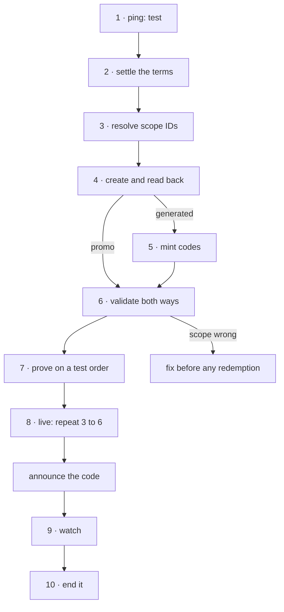

# Launching a promotion

**Policy:** [`SAFETY.md`](../SAFETY.md) · **Safety layer:**
[`epd-mcp-operator`](../docs/epd-mcp-operator.md) · **Index:** [recipes](./README.md)

A discount goes live that applies to exactly what was intended, at the rate
intended, for the customers intended — proven on a real order in test mode
first, with an end date, and with a way to see afterwards what it did.

The chain is shaped by one fact: **a coupon's rate cannot be changed once
anyone has used it.** After the first redemption, `percentage`, `amount` and
`duration` are locked, and a correction means a new coupon and a new code for
everyone who already has the old one. So every check in this recipe happens
before the code is announced.

## Outcome

- One coupon in live mode whose stored terms — kind, rate, duration, scope,
  caps, dates — match what the human agreed, read back field by field.
- Its scope proven in both directions: valid on what it should discount,
  refused on what it should not.
- The same terms proven on a real order in test mode, with the discount landing
  in the order's total.
- An end: an `expires_at`, or a stated reason for having none.
- A method for "what did it do", agreed before launch rather than improvised
  after.

**Not in this recipe.** Changing a list price is
[`epd-catalog`](../docs/epd-catalog.md). Revenue totals for the period are
[month-end reconciliation](./month-end-reconciliation.md); there is no coupon
breakdown in [`epd-reporting`](../docs/epd-reporting.md), so step 9 builds one.

## Before you start

Every one of these is a decision, and several are permanent. None may be
inferred ([rule 5](../SAFETY.md#5-a-missing-required-field-is-a-stop-not-a-guess)).

| Input | Why it matters |
|---|---|
| **Kind** — one shared code (`promo`) or many unique codes (`generated`) | Set at creation, never changeable. A `promo` name *is* the code: 4–50 characters of `A–Z`, `0–9` and `-`. |
| **Rate** — a percentage or an amount in minor units, not both | Locked after the first redemption. |
| `duration` — `once`, `repeating` with a cycle count, or `forever` | About **subscription cycles**, not the calendar. "Until the end of the month" is `expires_at`. |
| **Scope** — which products and which plans, both stated | Omitting both is accepted and means **every product and every plan**. |
| Per-customer cap | Defaults to **1** on a promo coupon — measured — whether or not anyone intended it. |
| Total cap, `minimum_amount`, first-time-only, `starts_at`, `expires_at` | Each changes who can use it. |
| For `generated`: how many codes | Over-minting cannot be undone. There is no delete for codes. |

## The chain



| # | Step | Skill | Tools | Tier (live) | Checkpoint |
|---|---|---|---|---|---|
| 1 | Establish test mode | operator | `ping` | T0 | test mode stated |
| 2 | Settle the terms | coupons | — | — | every term stated back and agreed |
| 3 | Resolve what it applies to | catalog | `list_products`, `list_plans` | T0 | IDs come from responses |
| 4 | Create and read back | coupons | `create_coupon`, `retrieve_coupon` | T2 | stored terms equal agreed terms |
| 5 | Mint codes (`generated` only) | coupons | `generate_coupon_codes`, `list_coupon_codes` | T2 | `total_count` equals the agreed count |
| 6 | Validate in both directions | coupons | `validate_coupon` | T0 | valid in scope, refused out of scope |
| 7 | Prove it on a test order | catalog | `create_order` | T1 | discount lands in the total |
| 8 | Recreate in live | operator, catalog, coupons | as 1, 3–6 | T2 | live read-back and validation pass |
| 9 | Watch it | coupons, triage | `retrieve_coupon`, `list_orders` | T0 | figures quoted from responses |
| 10 | End it | coupons | `update_coupon` or `archive_coupon`, `validate_coupon` | T2 / T3 | the code is refused |

## Steps

### 1. Establish test mode

**Skill:** [`epd-mcp-operator`](../docs/epd-mcp-operator.md) · **Tier:** T0

```
tool: ping
input: {}
```

**Checkpoint.** `environment: "test"`, `is_sandbox: true`, stated. Steps 2–7 run
here because step 7 redeems the coupon, and a redemption locks its terms.

**If it fails**

| Condition | What it means | Do |
|---|---|---|
| Live mode | Step 7 would lock a live coupon's rate on a real order | Stop and ask for the test key. |

### 2. Settle the terms

**Skill:** [`epd-coupons`](../docs/epd-coupons.md) · **Tier:** no call

Walk every row of *Before you start* with the human and write the answers into
the plan. State the rate as a number — "20% off", not "the discount we
discussed" — because after one redemption it is final.

**Checkpoint.** The human has agreed a complete set: kind, rate, duration,
product scope, plan scope, caps, dates, and for `generated` a count.

**If it fails**

| Condition | What it means | Do |
|---|---|---|
| "Summer Sale" as a promo | Spaces and lowercase are rejected for `promo` | Offer `SUMMER-SALE` as a promo, or a `generated` coupon with that display name. |
| "Runs until the 30th" given as a duration | A calendar end is `expires_at` | Set `expires_at`; ask separately how many subscription cycles it discounts. |
| No scope given | The default is everything | Ask. Do not create without both scopes. |

### 3. Resolve what it applies to

**Skill:** [`epd-catalog`](../docs/epd-catalog.md) · **Tier:** T0

```
tool: list_products
input:
  q: <human: product name or sku>
  limit: 10
```

```
tool: list_plans
input:
  search: <human: plan name>
  limit: 10
```

**Checkpoint.** Every ID in scope was read from a response here, and its name
read back to the human. IDs differ between modes; step 8 does this again.

**If it fails**

| Condition | What it means | Do |
|---|---|---|
| Several matches | Ambiguous name | List them and ask. |
| No match | Wrong mode, or it does not exist | Do not create the product from here; that is its own job in `epd-catalog`. |

### 4. Create the coupon and read it back

**Skill:** [`epd-coupons`](../docs/epd-coupons.md) · **Tier:** T1 here, T2 live

A promo, scoped to one product and no plans:

```
tool: create_coupon
input:
  name: <step 2: code>
  kind: promo
  percentage: <step 2: rate>
  duration: once
  product_scope: specific
  product_ids: <step 3: product ids>
  plan_scope: none
  max_redemptions: <step 2: total cap>
  expires_at: <step 2: end, ISO 8601 with timezone>
  idempotency_key: <new UUID v4>
```

```
tool: retrieve_coupon
input:
  id: <step 4: coupon.id>
```

**Checkpoint.** Compare every stored field with step 2: `kind`, `percentage` or
`amount`, `duration`, `product_scope`, `product_ids`, `plan_scope`, `plan_ids`,
`max_redemptions`, `max_redemptions_per_customer`, `starts_at`, `expires_at`,
and `active: true`. Say the per-customer cap out loud whatever it is — on a
promo it is `1` unless set.

**If it fails**

| Condition | What it means | Do |
|---|---|---|
| `validation_error`, "Exactly one of percentage or amount" | Both or neither | Fix from step 2. |
| `validation_error`, "At least one of product_scope or plan_scope must be non-none" | Both set to `none` | A coupon that discounts nothing. Revisit scope. |
| Scope reads `all` / `all` | Scope was omitted | Stop: this coupon discounts everything. `update_coupon` can still change scope before any redemption. |
| `value_too_large` on `percentage` | Over 100 | Fix from step 2. |

### 5. Mint the codes — `generated` coupons only

**Skill:** [`epd-coupons`](../docs/epd-coupons.md) · **Tier:** T1 here, T2 live

At most 500 per call; 2,000 codes is four calls, each confirmed with its count.

```
tool: generate_coupon_codes
input:
  id: <step 4: coupon.id>
  count: <step 2: number of codes, at most 500 per call>
  prefix: <step 2: prefix>
  idempotency_key: <new UUID v4>
```

```
tool: list_coupon_codes
input:
  id: <step 4: coupon.id>
  limit: 100
```

**Checkpoint.** `total_count` equals the agreed number.

**If it fails**

| Condition | What it means | Do |
|---|---|---|
| `validation_error` on a `promo` coupon | Promo coupons have one code | Nothing to mint. |
| `value_too_large` | Over 500 | Split into calls of 500. |
| Timeout | Unknown | Retry with the **same** key — measured: the replay succeeded and the coupon still held one batch, not two. |
| More codes than agreed | Over-minted | They cannot be deleted. Report it; `archive_coupon` retires the whole coupon, not codes. |

### 6. Validate in both directions

**Skill:** [`epd-coupons`](../docs/epd-coupons.md) · **Tier:** T0

`validate_coupon` creates nothing and redeems nothing. Validate **with the
context a real order would have**, once where it should apply and once where it
should not:

```
tool: validate_coupon
input:
  code: <step 2: code, or one code from step 5>
  customer_id: <human: a test customer id>
  amount: <step 3: product price in minor units>
  product_id: <step 3: an in-scope product id>
```

```
tool: validate_coupon
input:
  code: <step 2: code, or one code from step 5>
  customer_id: <human: a test customer id>
  product_id: <step 3: an out-of-scope product id>
```

**Checkpoint.** The first returns `valid: true` with the agreed rate; the second
returns `valid: false` with `reason: "product_not_eligible"`. That pair is what
proves the scope — a coupon that says yes to everything passes the first test
too.

**Bare-code validation is not a validity check.** Measured: `validate_coupon`
with only `code`, on a product-scoped coupon, returns `valid: false` and
`reason: "product_not_eligible"`. An agent that checks a code that way tells a
customer a working code is invalid.

**If it fails**

| Condition | What it means | Do |
|---|---|---|
| In-scope returns `product_not_eligible` | The wrong product IDs, or scope set on plans only | Compare `product_ids` with step 3. |
| Out-of-scope returns `valid: true` | Scope is wider than agreed | Fix scope with `update_coupon` now — before any redemption. |
| `plan_not_eligible` | A plan was checked and `plan_scope` excludes it | Expected if plans are out of scope. |
| `coupon_not_yet_active` / `coupon_expired` | Dates are off | Compare `starts_at` and `expires_at` with step 2. |

### 7. Prove it on a test order

**Skill:** [`epd-catalog`](../docs/epd-catalog.md) · **Tier:** T1 — test mode only

```
tool: create_order
input:
  customer_id: <human: a test customer id>
  payment_method_id: <human: that customer's test card id>
  items:
    - product_id: <step 3: an in-scope product id>
      quantity: 1
  coupon_code: <step 2: code>
  idempotency_key: <new UUID v4>
```

**Checkpoint.** `applied_coupon.code` is the code, `discount_amount` is the rate
applied to `subtotal`, `total` is `subtotal` minus `discount_amount`, and
`status` is `"succeeded"`. `retrieve_coupon` now shows `total_redemptions: 1`.
This test coupon's rate is now locked — which is why this step is in test.

**If it fails**

| Condition | What it means | Do |
|---|---|---|
| `code_not_found` | A typo; the whole order fails and nothing is charged | Compare with step 4. |
| `customer_limit_reached` | That customer has used it up to the per-customer cap | Expected on a second order with a cap of 1 — measured. Use another test customer. |
| `status: "failed"` with no error | The test card declined | A card problem, not a coupon problem. |

### 8. Recreate it in live

**Skills:** [`epd-mcp-operator`](../docs/epd-mcp-operator.md),
[`epd-catalog`](../docs/epd-catalog.md), [`epd-coupons`](../docs/epd-coupons.md) ·
**Tier:** T2

The test coupon does not exist in live. The human switches the MCP client to the
live key; `ping` must read `environment: "live"`. Then repeat steps 3, 4, 5 and
6 against live — step 3 especially, because live product IDs are not the test
ones.

> I'm about to call **`create_coupon`** named **<code>**, kind **promo**, **<rate>%
> off**, duration **once**, on products **<names>** and no plans, per-customer cap
> **<n>**, total cap **<n>**, expiring **<date>**, in **LIVE** mode. The rate is
> locked after the first redemption. Proceed?

Do not place a live test order unless it is a real sale; step 6's validation is
the live check.

**Checkpoint.** The live read-back and both validations pass. Only now is the
code announced.

**If it fails**

The tables of steps 3–6 apply. The one that matters most here:

| Condition | What it means | Do |
|---|---|---|
| Live scope wrong, not yet announced | No one has the code | Fix with `update_coupon` before announcing. |
| Live rate wrong, already redeemed | Locked — `update_coupon` returns `field_locked`, measured | A new coupon with a new code. Archive the old one (T3) so it stops being redeemable. |

### 9. Watch it

**Skills:** [`epd-coupons`](../docs/epd-coupons.md) for the coupon,
[`epd-transaction-triage`](../docs/epd-transaction-triage.md) owns the order
reads · **Tier:** T0

```
tool: retrieve_coupon
input:
  id: <step 8: live coupon.id>
```

For `generated` coupons, `list_coupon_codes` with `redeemed` shows which codes
were used. For what it earned there is no coupon filter on any tool, so page the
orders over the promotion's window and keep the ones carrying the code — order
rows include `applied_coupon`, measured:

```
tool: list_orders
input:
  created_after: <step 8: coupon starts_at or created_at>
  created_before: <step 8: coupon expires_at>
  status: succeeded,partially_refunded,refunded
  limit: 100
```

**Checkpoint.** Redemptions, discount given (the sum of `discount_amount`) and
revenue on discounted orders (the sum of `total`), each quoted from these
responses, with the window stated. Refunded orders are shown separately, not
netted silently.

**If it fails**

| Condition | What it means | Do |
|---|---|---|
| Many pages | One call per 100 orders against 60 a minute and 1,000 an hour | Narrow the window, or pace against the hourly budget. |
| `total_redemptions` and the order count disagree | Refunded or failed orders in the count | Report both and the difference. |

### 10. End it

**Skill:** [`epd-coupons`](../docs/epd-coupons.md) · **Tier:** T2 to move the end
date, T3 to archive

If `expires_at` was set, the promotion ends by itself and this step is a check.
To end it early, prefer moving `expires_at` — reversible, T2 — over archiving:

```
tool: update_coupon
input:
  id: <step 8: live coupon.id>
  expires_at: <human: new end, ISO 8601 with timezone>
  idempotency_key: <new UUID v4>
```

Archiving is T3 because it stops a live promotion at once:

> I'm about to call **`archive_coupon`** on **<code>** (`<step 8: live
> coupon.id>`), which has **<n>** redemptions, in **LIVE** mode. It stops new
> redemptions immediately; existing ones are kept. Proceed?

```
tool: archive_coupon
input:
  id: <step 8: live coupon.id>
  idempotency_key: <new UUID v4>
```

Then confirm what a customer now sees:

```
tool: validate_coupon
input:
  code: <step 8: live code>
  product_id: <step 8: an in-scope live product id>
```

**Checkpoint.** `valid: false` with `reason: "coupon_expired"` after the end
date, or `"coupon_inactive"` after archiving. Measured: an order carrying an
archived code fails with `coupon_inactive` and is not created.

**If it fails**

| Condition | What it means | Do |
|---|---|---|
| Archived by mistake | Restorable, in two calls | `unarchive_coupon`, then `update_coupon` with `active: true`, then validate. Unarchiving alone leaves it inactive. |
| Cannot find it to restore | Archived coupons leave the default list | `list_coupons` with `archived: "true"` — a **string**; `true` as a boolean is rejected with `invalid_value`, measured. |

## Where it can stop

| Stopped after | The account holds | Resume or clean up |
|---|---|---|
| 4 in live, before 6 | A live coupon nobody has checked | Do not announce it. Run step 6 now. |
| 5, over-minted | Extra codes that cannot be deleted | Report the count. They are only usable if distributed. |
| 7 | A redeemed test coupon, locked | Expected. It never reaches live. |
| 8, announced with wrong scope | Customers using a coupon on the wrong things | Fix scope — it stays editable after redemption. |
| 8, announced with wrong rate | Locked | New coupon, then archive the old one. |
| 10, archived early by mistake | A retired coupon | Unarchive, set `active: true`, validate. |

## Running it unattended

It does not. Creating a live coupon is T2 and archiving it T3, and no standing
authorization covers either. An unattended run refuses at step 8 and reports the
exact `create_coupon` arguments it would have sent — which is, usefully, the
same list a human has to approve.

Step 9 alone is T0 and can run on a schedule to report redemptions.

## What was verified

Run against the EPD sandbox on **28 September 2026**:

| Step | Measured |
|---|---|
| 4 | A promo scoped to one product and no plans: stored as `product_scope: "specific"`, `plan_scope: "none"`, `max_redemptions_per_customer: 1`, `active: true`, `total_redemptions: 0`. A `generated` coupon: `max_redemptions_per_customer: null` |
| 5 | `generate_coupon_codes` with `count: 5` returned five codes; the same call with the same key succeeded again and the coupon still held five, not ten |
| 6 | In scope, with customer, amount and product: `valid: true`. Out-of-scope product: `product_not_eligible`. A plan against `plan_scope: "none"`: `plan_not_eligible`. **Bare code:** `valid: false`, `product_not_eligible` |
| 7 | Order on a 100 product at 20%: `subtotal` 100, `discount_amount` 20, `total` 80, `applied_coupon` populated. Second order, same customer: `customer_limit_reached` |
| 8 | After one redemption, `update_coupon` `percentage` returns `field_locked`; `max_redemptions` still changes |
| 9 | `list_orders` rows carry `applied_coupon.code` and `discount_amount` |
| 10 | After `archive_coupon`: `active: false`, `validate_coupon` returns `coupon_inactive`, an order with the code fails `coupon_inactive`. `list_coupons` rejects `archived: true` with `invalid_value` |

**Not verified:** anything in live mode, and `duration: "repeating"` or
`"forever"` on a subscription, which needs renewals to observe.
