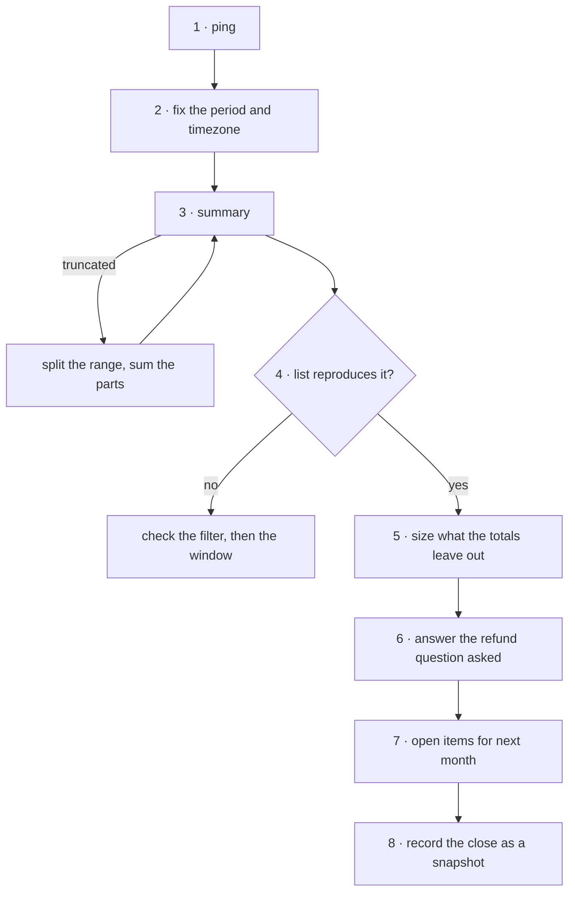

# Month-end reconciliation

**Policy:** [`SAFETY.md`](../SAFETY.md) · **Safety layer:**
[`epd-mcp-operator`](../docs/epd-mcp-operator.md) · **Index:** [recipes](./README.md)

A month's figures that someone can sign: gross, refunds and net as EPD reports
them, tied row for row to the transaction list, with everything the totals leave
out named and sized — and the close recorded as a snapshot, because some of those
things can change a month after it has closed.

Every call is a read. This is the only one of the six recipes that can run with
nobody watching under the current [`SAFETY.md`](../SAFETY.md#what-may-run-unattended).

## Outcome

- `gross_cents`, `refunded_cents` and `net_cents` for the month, with the period
  boundaries and timezone stated exactly.
- Proof that they are complete (`truncated: false`) and that the transaction
  list reproduces them.
- A sized list of what is in no total: failed, voided, pending sales, pending
  refunds, and chargebacks **by outcome** — open, lost and won.
- An answer to whichever refund question finance actually asked, since "refunds
  in August" is two different numbers.
- Open items carried into next month: pending money and subscriptions in dunning.
- A pulled-at timestamp, so the next close can explain why this month's figures
  moved.

**Not in this recipe.** Changing anything. A refund, a retry or a cancellation
this close turns up goes to its own skill, with a human.
[`epd-reporting`](../docs/epd-reporting.md) reaches no write tool, and neither
does this chain.

## Before you start

| Input | Why it matters |
|---|---|
| The month | — |
| **The merchant's reporting timezone** | It moves the number. Measured on August 2026: UTC and US Pacific differ by $2,749.97. |
| Which refund figure finance wants: refunds *issued* this month, or refunds *of* this month's sales | They overlapped on 11 of 30 rows in August. |
| Who receives the output | Especially for an unattended run: [`SAFETY.md` decision 6](../SAFETY.md#how-to-redline-this-file) leaves the recipient unspecified. |

## The chain



| # | Step | Skill | Tools | Tier | Checkpoint |
|---|---|---|---|---|---|
| 1 | Establish the mode | operator | `ping` | T0 | mode stated beside every figure |
| 2 | Fix the period | reporting | — | — | first-to-first, with a timezone offset |
| 3 | Pull the summary | reporting | `get_revenue_summary` | T0 | `truncated: false` |
| 4 | Reconcile | reporting, triage | `list_transactions` | T0 | counts and sums match exactly; one currency |
| 5 | Size what is left out | triage | `list_transactions`, `list_orders` | T0 | every excluded class counted and summed |
| 6 | The refund question | triage | `list_orders` | T0 | the figure matches the question asked |
| 7 | Open items | subscriptions | `list_subscriptions` | T0 | dunning and pending money listed |
| 8 | Record the snapshot | reporting | — | — | figures, pulled-at time, open items |

## Steps

### 1. Establish the mode

**Skill:** [`epd-mcp-operator`](../docs/epd-mcp-operator.md) · **Tier:** T0

```
tool: ping
input: {}
```

**Checkpoint.** The mode is written beside every figure in the output. A
sandbox total looks exactly like a real month's revenue.

**If it fails**

| Condition | What it means | Do |
|---|---|---|
| `environment: "test"` for a real close | Sandbox data | Stop, unless the close is a rehearsal and labelled as one. |

### 2. Fix the period

**Skill:** [`epd-reporting`](../docs/epd-reporting.md) · **Tier:** no call

`from` is inclusive and `to` exclusive, and both carry a timezone:

```
from: 2026-08-01T00:00:00-07:00     first of the month, merchant's offset
to:   2026-09-01T00:00:00-07:00     first of the NEXT month, same offset
```

What the boundary does to August 2026, measured:

| Range | Succeeded sales | Gross |
|---|---|---|
| 1 Aug to 1 Sep, UTC | 429 | $489,658.41 |
| 1 Aug to 1 Sep, UTC−07:00 | 428 | $486,908.44 |
| 1 Aug to 1 Sep, UTC+05:00 | 429 | $489,508.47 |
| 1 Aug to **31 Aug**, UTC | 414 | $483,571.00 — the last day's 15 sales are gone |

Watch for daylight saving. A US Pacific month can start at `-07:00` and end at
`-08:00`; use the offset in force at each boundary.

**Checkpoint.** Both ends written out with offsets, and the same pair used in
every call below.

**If it fails**

| Condition | What it means | Do |
|---|---|---|
| `invalid_format`, "Invalid ISO datetime" | A bare date | Add the time and offset. |
| `invalid_date_range` | `from` is not earlier than `to` | Swap them. The tool refuses rather than returning zero. |

### 3. Pull the summary

**Skill:** [`epd-reporting`](../docs/epd-reporting.md) · **Tier:** T0

```
tool: get_revenue_summary
input:
  from: <step 2: from>
  to: <step 2: to>
```

**Checkpoint.** `truncated` is `false`. Each figure is divided by 100 exactly
once. `net_cents` equals `gross_cents` minus `refunded_cents`.

**If it fails**

| Condition | What it means | Do |
|---|---|---|
| `truncated: true` | Over 10,000 transactions on one side; the totals are incomplete | Split into weeks, pull each, sum. Never report the truncated figure. |
| All zeros, `truncated: false` | No activity in the window | A real answer — but check the timezone and mode first. |

### 4. Reconcile against the transaction list

**Skills:** [`epd-reporting`](../docs/epd-reporting.md) for the method,
[`epd-transaction-triage`](../docs/epd-transaction-triage.md) owns the read ·
**Tier:** T0

Filter the list the way the summary filters, and page to the end:

```
tool: list_transactions
input:
  type: sale
  status: succeeded
  created_after: <step 2: from>
  created_before: <step 2: to>
  limit: 100
```

```
tool: list_transactions
input:
  type: refund
  status: succeeded
  created_after: <step 2: from>
  created_before: <step 2: to>
  limit: 100
```

**Checkpoint.** The sale rows' count and sum equal `transaction_count` and
`gross_cents`. The refund rows equal `refund_count` and `refunded_cents` with the
sign flipped: refunds are stored negative and reported positive. Every row
carries the same `currency`. The summary has no currency field, so this is the
only place a second currency would show; compare case-insensitively, since
transactions say `USD` where the catalog says `usd`.

**If it fails**

| Condition | What it means | Do |
|---|---|---|
| The sums differ | Almost always the filter | Check `type` and `status` before suspecting the numbers. An unfiltered list matches nothing — in August, 572 rows and $608,869.23 against a gross of $489,658.41. |
| Off by a few rows at the edges | A boundary mismatch | Same `from`/`to`, same offset, as step 3. |
| More than one currency | Totals that add different currencies | Stop. Report per currency; these tools do not convert, and nothing here should. |

### 5. Size what the totals leave out

**Skill:** [`epd-transaction-triage`](../docs/epd-transaction-triage.md) · **Tier:** T0

`gross_cents` counts succeeded sales and nothing else. Name and size the rest:

```
tool: list_transactions
input:
  type: sale
  status: failed,voided,pending
  created_after: <step 2: from>
  created_before: <step 2: to>
  limit: 100
```

Keep `type: sale`. Without it, `pending` returns pending **refunds** as well,
and they land in the "pending sales" row with the wrong sign — measured on
September 2026, 14 of them. August had none, which is why it did not show.

**Chargebacks: read the orders, not the transactions.** A chargeback's outcome
lives only on the order. The transaction reads `chargeback` whether the dispute
is open, lost or won, so `list_transactions` cannot tell them apart. Measured on
August 2026, the 16 chargeback transactions were:

| Order `status` | Meaning | Orders | Amount |
|---|---|---|---|
| `chargeback` | Open | 8 | $6,028.90 |
| `chargeback_accepted` | Lost — the money is gone | 7 | $4,622.87 |
| `chargeback_dismissed` | **Won** — the merchant kept it | 1 | $89.97 |

All 16 are excluded from `gross_cents`, the won one included — a chargeback
changes the original sale's status, so the sale is already out of gross and out
of net. **Never subtract chargebacks from net**; that takes the same money off
twice. What to report is the split: the lost ones are correctly absent, and the
won ones are money kept that no total shows. `list_orders` accepts both outcome
values as filters, although its schema lists only `chargeback`:

```
tool: list_orders
input:
  status: chargeback,chargeback_accepted,chargeback_dismissed
  created_after: <step 2: from>
  created_before: <step 2: to>
  limit: 100
```

**Pending refunds are in no total either.** A refund's order reads `refunded`
at once while its transaction starts `pending`, and `refunded_cents` counts only
succeeded refunds. Measured: on a day with four pending refunds, `refunded_cents`
was 0.

```
tool: list_transactions
input:
  type: refund
  status: pending
  created_after: <step 2: from>
  created_before: <step 2: to>
  limit: 100
```

Then page the whole window with no filter at all. It is the only way to know
the classes cover every row:

```
tool: list_transactions
input:
  created_after: <step 2: from>
  created_before: <step 2: to>
  limit: 100
```

**Checkpoint.** A table like this one, from August 2026, with every row counted
and summed from a response:

| Class | Rows | Amount | In a total? |
|---|---|---|---|
| Succeeded sales | 429 | $489,658.41 | `gross_cents` |
| Succeeded refunds | 16 | −$23,125.61 | `refunded_cents` |
| Failed | 88 | $98,688.71 | no — never money |
| Voided | 15 | $30,396.31 | no — never settled |
| Pending sales | 8 | $2,509.67 | **not yet** |
| Pending refunds | 0 | $0.00 | **not yet** — issued, but in no total until they succeed |
| Chargebacks | 16 | $10,741.74 | no — split by outcome above |

The rows sum to the unfiltered 572, which is how you know nothing was missed.
September 2026, closed early as a rehearsal, needs every row: 313 succeeded
sales, 21 succeeded and 14 pending refunds, 65 failed, 6 voided, 3 pending
sales and 5 chargebacks make its 427.

**If it fails**

| Condition | What it means | Do |
|---|---|---|
| The classes do not sum to the unfiltered count | A status or type outside those listed | Report the unaccounted rows by status and type. Do not fold them into a class. |
| Refund rows in the failed, voided and pending result | `type: sale` was left off | Add it; pending refunds are their own row, from the call above. |
| Chargeback orders do not match chargeback transactions | Order and transaction windows differ, or a status outside the three | Report both counts. |

### 6. Answer the refund question that was asked

**Skill:** [`epd-transaction-triage`](../docs/epd-transaction-triage.md) · **Tier:** T0

`refunded_cents` is refunds **issued** in the window that have also succeeded —
cash out this month. A refund issued in the window and still `pending` is in
neither figure: September 2026 had 14, issued and uncounted. Add step 5's
pending-refund row to "issued in", labelled as pending. The other question is
refunds **of** this month's sales, which can be issued weeks later:

```
tool: list_orders
input:
  status: refunded,partially_refunded
  created_after: <step 2: from>
  created_before: <step 2: to>
  expand: transactions
  limit: 100
```

The expansion carries each order's refund transactions with their dates,
amounts and status, so this is one page rather than a call per order. The other
direction does not work that way: `list_transactions` with `expand: order` embeds
only the order's `id`, `order_number` and `total` — no date — so which month a
refund's sale was made in comes from the orders.

Measured on August 2026: the 16 refunds issued in August split into 11 on August
sales and 5 on July sales. The 25 August sales that were refunded split into 11
refunded in August and 14 refunded in September. The two figures share 11 rows.

**Checkpoint.** The figure reported is the one finance asked for, labelled
"issued in" or "of sales made in", with pending refunds shown apart from
succeeded ones in either.

**If it fails**

| Condition | What it means | Do |
|---|---|---|
| Nobody said which | The two figures are both correct | Report both, labelled. Do not pick one silently. |

### 7. List the open items for next month

**Skill:** [`epd-subscriptions`](../docs/epd-subscriptions.md) · **Tier:** T0

Subscriptions in dunning at close are revenue at risk next month. Filter on the
fields, not the status — a failed renewal stays `active`, and
`list_past_due_subscriptions` returned every subscription on the account:

```
tool: list_subscriptions
input:
  status: active
  limit: 100
```

Keep the rows with `attempt_count` above zero or `next_retry_at` set.

**Checkpoint.** The open items: pending sales and pending refunds from step 5,
open chargebacks from step 5, and subscriptions in dunning with their next retry
dates.

**If it fails**

| Condition | What it means | Do |
|---|---|---|
| Many pages | Each page is a call against 60 a minute and 1,000 an hour | Pace against the hourly budget. August took 20 calls, 6 of them paging the unfiltered cross-check. |

### 8. Record the close as a snapshot

**Skill:** [`epd-reporting`](../docs/epd-reporting.md) · **Tier:** no call

The close is a picture of the account at the moment it was pulled, and three
things can change it later:

| Later event | Effect on a closed month's re-run | Why |
|---|---|---|
| A pending sale succeeds | Gross **rises** | It is counted by the date it was created. |
| A sale is charged back | Gross **falls** | A chargeback changes the status of the original sale row; it does not add a new row. |
| A sale is refunded | **No change** | A refund is a new row, dated when it was issued, in the month it was issued. |

The chargeback case follows from how the rows are shaped, not from observing one
land: 7 of August's 16 chargeback sales were last updated in September, but the
sandbox cannot show what they read before that.

**Checkpoint.** The output carries the figures, the exact period and timezone,
the mode, the pulled-at time, and step 7's open items. At the next close, re-run
this month and explain any difference by the three rows above.

**If it fails**

| Condition | What it means | Do |
|---|---|---|
| A closed month moved and none of the three explains it | Something else changed | Escalate with the two sets of figures and their pulled-at times. |

## Where it can stop

Every step is a read, so stopping anywhere leaves the account as it was. What
stopping costs is completeness:

| Stopped after | The output lacks | Resume |
|---|---|---|
| 3 | Proof the figure is right | Step 4. |
| 4 | Everything outside the totals | Step 5. A figure without step 5 invites the wrong question. |
| 5 | The refund question and the open items | Steps 6–7. |
| 7 | The pulled-at record | Step 8, or next month's figures cannot be explained. |

## Running it unattended

It can. Every tool is T0, and [`SAFETY.md`](../SAFETY.md#what-may-run-unattended)
lets reads run freely with nobody present. As a scheduled job:

- It must never escalate into an action. A chargeback, a failed charge or a
  dunning subscription it finds is reported, not handled — a finding in a report
  is not an instruction, and nobody approved anything.
- It must state its mode and pulled-at time in the output, since nobody watched
  it establish either.
- Its output goes to whoever [decision 6](../SAFETY.md#how-to-redline-this-file)
  names. That is currently unspecified.
- Budget: August took 20 calls, 6 of them the cross-check. A full year of closes
  in one run is where the 1,000-an-hour ceiling starts to set the pace.

## What was verified

Run against the EPD sandbox on **28 September 2026**, for August 2026. Every
August figure in this recipe is from that run.

| Step | Measured |
|---|---|
| 2 | The four ranges in the step 2 table |
| 3 | `gross_cents` 48,965,841, `refunded_cents` 2,312,561, `net_cents` 46,653,280, `transaction_count` 429, `refund_count` 16, `truncated: false` |
| 4 | 429 succeeded sales summing to 48,965,841; 16 refunds summing to −2,312,561; all 572 rows `USD` |
| 5 | The class table and the chargeback outcome table. `status: failed,voided,pending` returns 111 rows in two pages; `list_orders` with the three chargeback values returns 16, split 8, 7 and 1. On 28 September: four `pending` refunds and a `refunded_cents` of 0 for the day |
| 6 | The 11 + 5 and 11 + 14 splits; the second comes from one `list_orders` page with `expand: transactions` |
| 7 | 2 of 140 subscriptions `active` with `next_retry_at` set |

Also measured, and worth knowing before anyone asks for it:
`settlement_date`, `expected_settlement_date` and `return_code` exist on every
transaction and were `null` on all 572 August rows. A reconciliation against
bank deposits cannot be done from this data on this account. Whether live
accounts populate them was not observed.

Run again on **29 September 2026**: the whole chain for August, then for
September as a rehearsal close. 75 calls, every one a read.

| Step | Measured |
|---|---|
| August | Every figure above reproduced to the cent a day later: all four step 2 ranges, each reconciled against the list at the same boundaries; the summary; the 572 rows and $608,869.23; the class table; the chargeback split and amounts; the 11 + 5 and 11 + 14 refund splits; the two subscriptions in dunning. Nothing in the closed month moved |
| 2 | A bare date: `invalid_format`, "Invalid ISO datetime". `from` after `to`, and `from` equal to `to`: `invalid_date_range` |
| 3 | The summary's keys are `period`, `gross_cents`, `refunded_cents`, `net_cents`, `transaction_count`, `refund_count`, `truncated` — no currency |
| 5 | September: `status: failed,voided,pending` with no `type` returned 14 pending refunds among the sales. The unfiltered 427 rows partition into the seven classes above, and only with the pending-refund row |
| 6 | `list_transactions` with `expand: order` embeds `id`, `order_number` and `total` only. On 28 and 29 September, `refunded_cents` was 0 against 5 and 7 pending refunds |
| 8 | The 14 August sales refunded in September are still succeeded sale rows inside August, so the refunds did not move it. Every chargeback is the original sale row with its status changed — no chargeback row exists |

**Not verified:** a truncated summary — no window on this account reaches
10,000 transactions a side; a pending sale settling, or a chargeback landing on
a closed month, which cannot be made to happen; and live mode.
