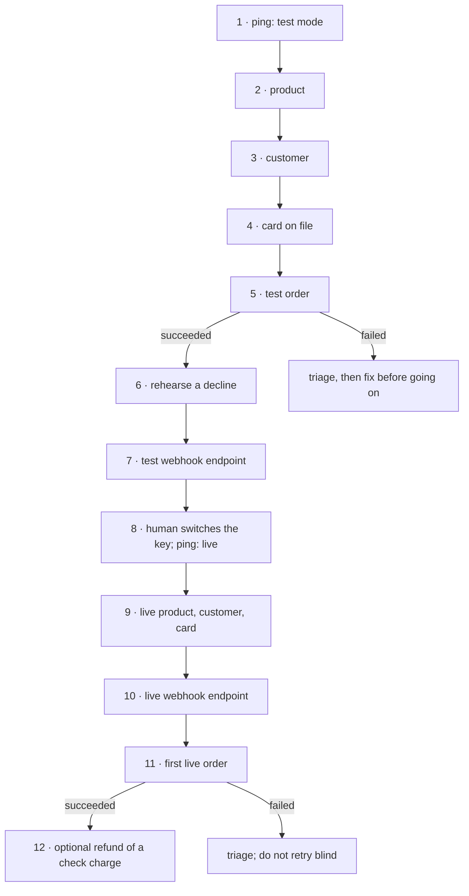

# New merchant to first live charge

**Policy:** [`SAFETY.md`](../SAFETY.md) · **Safety layer:**
[`epd-mcp-operator`](../docs/epd-mcp-operator.md) · **Index:** [recipes](./README.md)

An account that has never taken a payment through this surface takes its first
real one. Every piece that charge depends on is proven in test mode first, then
built again in live mode, because nothing created in test exists in live.

## Outcome

When the chain finishes:

- the product being sold exists in live mode, with the price and shipping flag
  the merchant stated, read back rather than assumed;
- the customer exists **once**, with a card on file;
- one live order reads `succeeded`, with one succeeded `sale` transaction for the
  amount the confirmation quoted;
- if the merchant runs a webhook receiver, a live endpoint is registered, its
  secret is in the merchant's hands, and the delivery log shows the first live
  order reaching it;
- the decline path was exercised in test, so the first real decline is not also
  the first time anyone sees one.

**Not in this recipe.** Building the merchant's own checkout is integration work
([`epd-quickstart`](../docs/epd-quickstart.md)). A subscription as the first
charge is [`epd-subscriptions`](../docs/epd-subscriptions.md); the cycle-1
read-back in [failed payment recovery](./failed-payment-recovery.md#9-confirm-the-customer-paid-exactly-once)
applies to it. Pinning the account's API version is a separate, one-way decision
flagged at step 1 and not taken here.

## Before you start

The human supplies these. A missing one is a stop, not a guess
([`SAFETY.md` rule 5](../SAFETY.md#5-a-missing-required-field-is-a-stop-not-a-guess)).

| Input | Why it cannot be inferred |
|---|---|
| Product `name` (3–80) and `description` (3–2000) | Both are required. A missing description fails as `invalid_type`, which reads like a bug. |
| Price in **minor units** and currency | `2999` is $29.99. There is no amount on an order; the price comes from here. |
| `requires_shipping` | Decides whether every future order for this product needs an address. |
| `sku` — lowercase, digits, `-` or `_`, 3–30 chars | Unique per account, so it is also the re-run guard. |
| Customer email, first and last name, phone in E.164 | All four are required by `create_customer`. |
| How the card arrives: a browser with EPD Elements, or headless | Picks the tool. Guessing produces a token the tool rejects ([rule 8](../SAFETY.md#8-raw-card-data-never-touches-the-mcp-surface)). |
| Webhook receiver URL and the events it handles — or "none" | Event names are not validated anywhere, so they must come from the receiver's owner. |
| Both keys: `epd_test_sk_…` for stage 1, `epd_live_sk_…` for stage 3 | The agent cannot switch modes. The MCP client holds the key. |

## The chain



| # | Step | Skill | Tools | Tier (live) | Checkpoint |
|---|---|---|---|---|---|
| 1 | Establish test mode | operator | `ping` | T0 | `environment: "test"` and `is_sandbox: true` agree |
| 2 | Create the product | catalog | `list_products`, `create_product` | T2 | price and shipping flag read back as stated |
| 3 | Create the customer | onboard | `list_customers`, `create_customer` | T2 | exactly one customer with that email |
| 4 | Card on file | onboard | `secure.epd.com` or `add_payment_method`, `list_payment_methods` | T2 | the card is listed and is the default |
| 5 | First test order | catalog | `create_order` | T3 | order `status: "succeeded"`, total equals the price |
| 6 | Rehearse a decline | catalog, triage | `create_order`, `get_order` | T3 | decline reported as a decline, not a success |
| 7 | Test webhook endpoint | webhook-ops | `create_webhook_endpoint`, `list_webhook_events`, `list_webhook_delivery_logs` | T2 | the order's event is recorded, and its delivery logged |
| 8 | Switch to live | operator | `ping` | T0 | `environment: "live"`, merchant name as expected |
| 9 | Live product, customer, card | catalog, onboard | as 2–4 | T2 | each read back, one confirmation per object |
| 10 | Live webhook endpoint | webhook-ops | as 7 | T2 | secret captured, events confirmed |
| 11 | First live order | catalog | `create_order`, `get_order` | T3 | `succeeded`, one succeeded sale, delivery logged |
| 12 | Refund a check charge (optional) | refunds | `refund_order` | T3 | order reads `refunded` |

## Steps

**Stage 1 — rehearse in test mode.** Every write in this stage is T1: proceed,
then name every object created.

### 1. Establish test mode

**Skill:** [`epd-mcp-operator`](../docs/epd-mcp-operator.md) · **Tier:** T0

```
tool: ping
input: {}
```

**Checkpoint.** `environment` is `"test"` and `is_sandbox` is `true`. State it in
words before the first write: *"Connected to <name> in test mode. No real
charges will be processed."* Read `api_version` too: `null` means the account is
not pinned. The MCP client's `epd-version` header pins each request regardless —
the response echoes `epd-version: 2026-02-11` — so this is a note for the
merchant, not a blocker. `upgrade_account_api_version` pins the account, is T3
and cannot be undone; it is not part of this recipe.

**If it fails**

| Condition | What it means | Do |
|---|---|---|
| `environment` and `is_sandbox` disagree | Something between agent and server is not what it seems | Stop. Do not pick one. |
| `environment: "live"` | Stage 1 would write real objects | Stop and ask for the test key. Rehearsal belongs in test. |
| HTTP 403 `insufficient_permissions` | A restricted key; the MCP endpoint refuses them outright | A full-access key is needed. Do not look for another route. |

### 2. Create the product

**Skill:** [`epd-catalog`](../docs/epd-catalog.md) · **Tier:** T1 here, T2 live

Read first. `q` matches the SKU as well as the name — measured:

```
tool: list_products
input:
  q: <human: sku>
  limit: 10
```

Nothing found, so create it:

```
tool: create_product
input:
  name: <human: name>
  description: <human: description>
  pricing:
    amount: <human: price in minor units>
    currency: <human: currency>
  requires_shipping: <human: true or false>
  sku: <human: sku>
  idempotency_key: <new UUID v4>
```

**Checkpoint.** The response's `pricing.amount`, `pricing.currency` and
`requires_shipping` are what the human said. Report the product `id` — it is
test-mode only and will not exist in stage 3.

**If it fails**

| Condition | What it means | Do |
|---|---|---|
| `list_products` returns the SKU | A previous run got this far | Read it with `get_product`. If price and shipping match, use it; if not, ask. Do not create a variant. |
| `sku_already_exists` | SKUs are unique per account — measured | Same as above. Never "fix" it by altering the SKU. |
| `invalid_type` naming `description` | A required field is missing | Ask for it. Do not write one. |
| `invalid_format` on `sku` | Uppercase or spaces — measured | Propose a corrected SKU and get it confirmed. |
| `value_too_large` on `sku` | Over 30 characters — measured | The same. |
| Timeout | Unknown whether it was created | Retry with the **same** key. MCP replays it — measured: the same product `id` came back. |

### 3. Create the customer

**Skill:** [`epd-onboard-customer`](../docs/epd-onboard-customer.md) · **Tier:** T1 here, T2 live

```
tool: list_customers
input:
  email: <human: email>
  limit: 10
```

```
tool: create_customer
input:
  email: <human: email>
  first_name: <human: first name>
  last_name: <human: last name>
  phone: <human: phone, E.164>
  idempotency_key: <new UUID v4>
```

**Checkpoint.** Exactly one customer has this email. Report its `id`.

**If it fails**

| Condition | What it means | Do |
|---|---|---|
| `list_customers` already returns one | This person exists | Confirm with the human it is the same person, then reuse it. |
| `email_already_exists` or `phone_already_exists` | Unique constraint — measured | Read the existing record. Never create a second customer with a tweaked email. |
| `field_errors` lists several fields | Validation reports every bad field at once | Ask for all of them in one message. |

### 4. Put a card on file

**Skill:** [`epd-onboard-customer`](../docs/epd-onboard-customer.md) · **Tier:** T1 here, T2 live

Two routes, and the human's answer from *Before you start* picks one.

**Browser in the loop.** The frontend runs EPD Elements with a **publishable**
key and hands over a single-use `card_token`:

```
tool: add_payment_method
input:
  customer_id: <step 3: customer.id>
  card_token: <human: cct_ token from Elements, under 15 minutes old>
  set_as_default: true
  idempotency_key: <new UUID v4>
```

**Headless.** The only step in any recipe that touches a card number, and the
only one that leaves the MCP surface:

```http
POST https://secure.epd.com
Authorization: Bearer <secret key for the current mode>
X-EPD-Idempotency-Key: <new UUID v4>

{ "customer_id": "<step 3: customer.id>",
  "card": { "number": "…", "exp_month": "…", "exp_year": "…", "cvc": "…" },
  "set_as_default": true }
```

In test, `4111 1111 1111 1111` with any future expiry succeeds. Measured
response: `201` with `id`, `type`, `card.brand`, `card.last4`,
`card.card_expires`, `customer`, `is_default`, `created_at`.

Then read it back:

```
tool: list_payment_methods
input:
  customer_id: <step 3: customer.id>
```

**Checkpoint.** The card appears with the expected brand and last four and
`is_default: true`. Report brand and last four only.

**If it fails**

| Condition | What it means | Do |
|---|---|---|
| `secure.epd.com` times out | It may have vaulted the card anyway | **Do not resend.** Call `list_payment_methods` first. A resend under the same key returns `409 idempotency_key_conflict`; under a new key it can vault the card twice. |
| A card number appears in chat | Rule 8 | Refuse to put it in any tool call and route to one of the two paths above. Do not repeat it back. |
| `invalid_format` on `card_token` | Not a `cct_` token — often a test card number pasted into the wrong field | Capture again through Elements. Tokens are single use and expire in 15 minutes. |

### 5. Place the first test order

**Skill:** [`epd-catalog`](../docs/epd-catalog.md) · **Tier:** T1 here, T3 live

```
tool: create_order
input:
  customer_id: <step 3: customer.id>
  payment_method_id: <step 4: payment method id>
  items:
    - product_id: <step 2: product.id>
      quantity: 1
  idempotency_key: <new UUID v4>
```

**Checkpoint.** Read `status` on the response — not just the absence of an
error. `status` is `"succeeded"`, `total` equals the product price times
quantity, and `transactions` holds one `sale` with `status: "succeeded"`.
Report the order `id` and `order_number`.

**If it fails**

| Condition | What it means | Do |
|---|---|---|
| No error, but `status: "failed"` | **A decline is a successful call.** Measured: `isError` was false and the order came back `failed` | Treat it as a decline. Hand to [`epd-transaction-triage`](../docs/epd-transaction-triage.md) before anything else. |
| `shipping_address_required` | One line item has `requires_shipping: true` | Ask for the address and pass it inline as `shipping_address`. Never invent a `shipping_address_id`. |
| `resource_not_found` naming the product | Wrong ID, or an ID from the other mode | Re-read step 2's response. |
| `total` differs from the price | Something other than the catalog price applied | Stop and explain the difference before going further. |
| Timeout | Unknown whether it charged | Retry with the **same** key. |

### 6. Rehearse a decline

**Skill:** [`epd-catalog`](../docs/epd-catalog.md), then
[`epd-transaction-triage`](../docs/epd-transaction-triage.md) · **Tier:** T1 (test only)

`secure.epd.com` has no declining test number — `4000 0000 0000 0002` succeeds
there. The decline token attaches over REST, and to a **separate** customer: a
customer with recent declines was once seen to decline on a good card as well.
Create that customer as in step 3, then:

```http
POST https://api.epd.com/v1/customers/<step 6: decline customer.id>/payment_methods
{ "billing_id": "card_visa_declined" }
```

Place an order for them as in step 5, with the payment method that call returned,
then read it:

```
tool: get_order
input:
  id: <step 6: declined order.id>
  expand: transactions
```

**Checkpoint.** The agent reports a **decline**, with the order's `failure_code`
and its class from triage. Measured: `status: "failed"`, `failure_code:
"processor_declined"`, `attempt_count: 1`, `next_retry_at: null`. Every sandbox
decline returns `processor_declined`, so this proves the failure branch runs,
not which decline it handled.

**If it fails**

| Condition | What it means | Do |
|---|---|---|
| The agent reports success | It checked `isError` and not `status` | This is the defect the step exists to catch. Fix it before stage 3. |
| The order succeeds | The token did not attach, or the wrong card was used | Check the payment method on the order. |

### 7. Register a test webhook endpoint

**Skill:** [`epd-webhook-ops`](../docs/epd-webhook-ops.md) · **Tier:** T1 here, T2 live

Skip this step and step 10 if the merchant has no receiver.

```
tool: create_webhook_endpoint
input:
  url: <human: https receiver URL>
  enabled_events: <human: event names the receiver handles>
  description: <human: label>
  idempotency_key: <new UUID v4>
```

The response carries `signing_secret`, **once** — `get_webhook_endpoint` never
returns it. Give it to the human immediately and say it will not be shown again;
do not put it in a logged summary. Read the event names back character by
character — `order.suceeded` is accepted and matches nothing. Place one more
test order as in step 5, then read what the endpoint was sent, and then what
was delivered:

```
tool: list_webhook_events
input:
  id: <step 7: endpoint.id>
  limit: 10
```

```
tool: list_webhook_delivery_logs
input:
  id: <step 7: endpoint.id>
  limit: 10
```

The events list is the one that proves the names: it records each event the
endpoint matched, whether or not anything was delivered. Measured: an
`order.succeeded` event for the test order within 15 seconds; `*` and `order.*`
also matched `order.created`.

**Checkpoint.** The test order's event is in `list_webhook_events`, and a
delivery for it is logged, and the receiver accepted it.

**If it fails**

| Condition | What it means | Do |
|---|---|---|
| `validation_error`, "URL must be a valid HTTPS endpoint" | `http://` | Ask for the HTTPS URL. |
| No event for the order | An event name is wrong, or nothing matching happened | Compare event names with the receiver's owner. |
| The event is there, but the log is empty | EPD matched it and would not send it. Measured: a host that is not publicly reachable is accepted at registration, then nothing is delivered **and nothing is logged**; `test_webhook_endpoint` on it returns `invalid_url`, "internal or private network address" | Get a public HTTPS URL from the receiver's owner. |
| Entries show failures | EPD is sending; the receiver rejects or is unreachable | Receiver code — [`epd-webhooks`](../docs/epd-webhooks.md). |
| The secret was not captured | Write-only after creation | `rotate_webhook_secret` (T3) issues a new one; it starts a 24-hour overlap. |

Do not plan on switching the endpoint off later. `update_webhook_endpoint` with
`disabled: true` returns success and leaves it `enabled` — measured twice. The
only way to stop deliveries today is `delete_webhook_endpoint`, which is T3 and
loses the delivery history.

**Stage 2 — cut over.**

### 8. Switch to live mode

**Skill:** [`epd-mcp-operator`](../docs/epd-mcp-operator.md) · **Tier:** T0

The human changes the key in the MCP client's configuration to `epd_live_sk_…`
and reconnects. The agent cannot do this, and should not be handed a key to do
it with. Then:

```
tool: ping
input: {}
```

**Checkpoint.** `environment: "live"`, `is_sandbox: false`, and `name` is the
merchant the human expects. Say it out loud: *"Connected to <name> in LIVE mode.
Writes from here move real money."* From here every write is T2 or T3 and waits
for an explicit yes.

**If it fails**

| Condition | What it means | Do |
|---|---|---|
| Still `test` | The client did not reload the key | Ask the human to restart the client. |
| Unexpected merchant `name` | The wrong account's key | Stop. |

**Stage 3 — the first live charge.** Nothing from stage 1 exists here. A
test-mode ID used now should fail as not found — the object is not in this mode —
and that failure is the correct outcome, not something to work around.

### 9. Build the product, customer and card again, in live

**Skills:** [`epd-catalog`](../docs/epd-catalog.md),
[`epd-onboard-customer`](../docs/epd-onboard-customer.md) · **Tier:** T2

Repeat steps 2, 3 and 4 against live. The reads come first as before; each write
is its own confirmation, never one approval for all three:

> I'm about to call **`create_product`** for **<name>** at **<price> <currency>**,
> `requires_shipping: <value>`, SKU `<sku>`, in **LIVE** mode. This creates the
> catalog entry; nothing is charged. Proceed?

For the card, prefer the browser route. A live `secure.epd.com` call puts a real
card number through the process making it, and so into the merchant's PCI scope
for that call. For a go-live check, the card should be one the merchant
controls.

**Checkpoint.** The same read-backs as steps 2–4, against live IDs. Report every
live ID.

**If it fails**

The failure tables of steps 2–4 apply unchanged. In addition:

| Condition | What it means | Do |
|---|---|---|
| A test card number declines or is refused | Test numbers only work with a test key | Use a real card. |
| The human says "yes to all three" | Batching at T2 | One confirmation per object, unless they approve an explicit batch naming each ([decision 3](../SAFETY.md#how-to-redline-this-file)). |

### 10. Register the live webhook endpoint

**Skill:** [`epd-webhook-ops`](../docs/epd-webhook-ops.md) · **Tier:** T2

Step 7 again, against live, before the first live order so that order has a
delivery to check. The live endpoint has its **own** secret; the test secret
will not verify live deliveries.

> I'm about to call **`create_webhook_endpoint`** for
> **<URL>**, events **<names>**, in **LIVE** mode. It returns a signing secret
> once. Proceed?

**Checkpoint.** Secret handed to the human; event names confirmed back.

**If it fails**

Step 7's table applies.

### 11. Place the first live order

**Skill:** [`epd-catalog`](../docs/epd-catalog.md) · **Tier:** T3 — it charges a
card. The server does not annotate it destructive;
[decision 1](../SAFETY.md#how-to-redline-this-file) holds every charge to T3

> I'm about to call **`create_order`** for customer **<name>** (`<step 9:
> customer.id>`): 1 × **<product>** at **<price> <currency>**, charged to the
> **<brand>** ending **<last4>**, in **LIVE** mode. This takes real money.
> Proceed?

```
tool: create_order
input:
  customer_id: <step 9: live customer.id>
  payment_method_id: <step 9: live payment method id>
  items:
    - product_id: <step 9: live product.id>
      quantity: 1
  idempotency_key: <new UUID v4>
```

```
tool: get_order
input:
  id: <step 11: order.id>
  expand: transactions
```

**Checkpoint.** `status: "succeeded"`, `total` as quoted, one `sale` with
`status: "succeeded"`, and — with an endpoint — this order's event in
`list_webhook_events` and its delivery in `list_webhook_delivery_logs`, as in
step 7. Report the order `id`, `order_number`, amount and card last four.

**If it fails**

| Condition | What it means | Do |
|---|---|---|
| `status: "failed"` | A real decline | [Failed payment recovery](./failed-payment-recovery.md), from step 2. Never retry to find out. |
| Timeout | Unknown whether it charged | Retry with the **same** key; MCP replays. Then `get_order`. |
| No delivery logged | Event names, a URL EPD will not send to, or the receiver — the events list says which | Step 7's table. The charge itself stands. |

### 12. Refund a check charge — optional

**Skill:** [`epd-refunds`](../docs/epd-refunds.md) · **Tier:** T3

Only if the first live charge was a check on a card the merchant controls rather
than a sale. Whether to run a check at all is the merchant's decision, not this
recipe's.

> I'm about to call **`refund_order`** on order `<step 11: order.id>` for the full
> **<total> <currency>** to the **<brand>** ending **<last4>**, in **LIVE** mode.
> This is irreversible. Proceed?

```
tool: refund_order
input:
  order_id: <step 11: order.id>
  idempotency_key: <new UUID v4>
```

**Checkpoint.** The order reads `refunded`. Measured in test: it does so at once,
while the refund transaction starts `pending` — and a pending refund is counted
in no revenue total until it settles. Tell the human "refund issued", not "the
money is back".

**If it fails**

| Condition | What it means | Do |
|---|---|---|
| `invalid_state_transition`, "Current status: refunded" | Already refunded — measured | Nothing to do. It is not a second refund. |
| Timeout | Unknown | Retry with the **same** key. |

## Where it can stop

A run can end after any step. What the account holds at that point, and how to
pick it up:

| Stopped after | The account holds | Resume or clean up |
|---|---|---|
| 2 | A product, nothing else | Resume at 3. Harmless. |
| 3 | A customer with no card | Resume at 4, or leave it. Deleting is T3 and not worth it. |
| 4, `secure.epd.com` timed out | Possibly a vaulted card | `list_payment_methods` before anything else. |
| 5 or 11, declined | A `failed` order row that stays — `create_order` does not delete it | Nothing was charged. Triage it. |
| 7 or 10, secret not captured | An endpoint nobody can verify | Rotate (T3) or delete (T3). It cannot be switched off. |
| 8 | Live mode confirmed, nothing live created | Resume at 9. |
| 9, partway | Some live objects, not all | Each was confirmed and reported; re-read and continue. The SKU and email constraints stop duplicates. |
| 11 | The first live charge — the outcome | Step 12 only if it was a check. |

## Running it unattended

It does not. Stage 3 is all T2 and T3, and the key switch at step 8 is a human
action by definition. Under [`SAFETY.md`](../SAFETY.md#pre-flight-refuse-to-start-not-to-finish)
an unattended run pre-flights the whole chain and refuses to start, reporting
step 9 as the first blocked write:

```
blocked: create_product (T2 write), mode live
intended: name "<name>", pricing <amount> <currency>, requires_shipping <value>, sku "<sku>"
needs:    explicit approval of this object
done:     nothing — the run did not start
```

Stage 1 alone can run unattended — its writes are T1 — but a rehearsal nobody
watched has not rehearsed anything for anyone.

## What was verified

Run against the EPD sandbox on **28 September 2026** as one chain, with objects
named `recipe-f` and reported:

| Step | Measured |
|---|---|
| 1 | `environment: "test"`, `is_sandbox: true`, `api_version: null`; response header `epd-version: 2026-02-11` |
| 2 | `list_products` with `q` set to the SKU finds the product. A second `create_product` with the same SKU and a new key returns `sku_already_exists`; the same key replays the original `id` |
| 3 | A second `create_customer` with the same email returns `email_already_exists` |
| 4 | `secure.epd.com` returns `201` with the fields listed; `list_payment_methods` shows the card as default |
| 5 | `create_order` returns `status: "succeeded"`, `total` equal to the price, one succeeded `sale` |
| 6 | The decline token attaches over REST; `create_order` returns **no error** and an order with `status: "failed"`, `failure_code: "processor_declined"`, `attempt_count: 1`, `next_retry_at: null` |
| 7 | Registration and the `disabled` no-op were measured on a probe endpoint in [webhook version migration](./webhook-version-migration.md#what-was-verified). Deliveries were not: there was no receiver to send them to. |
| 12 | `refund_order` returns the order as `refunded` with a `pending` refund transaction; a second refund returns `invalid_state_transition` |

Stage 1 run again on **29 September 2026**, every failure branch the sandbox
can reach included, on objects named `retest-*` / `recipe-f.retest-nm*`: 86
calls. Every charge was refunded and every endpoint deleted; the two products
and three customers remain as evidence.

| Step | Measured |
|---|---|
| 1 | As above, plus `x-epd-test-mode: true; No real charges will be processed`. A restricted key: HTTP 403 `insufficient_permissions`, on `ping` too |
| 2 | No description: `invalid_type`, `param: "description"`. Uppercase or a space in the SKU: `invalid_format`; over 30 characters: `value_too_large`. Same key: same `id`; new key: `sku_already_exists` |
| 3 | Three bad fields in one call: all three in `field_errors`. Same key: same customer. Same email: `email_already_exists`; same phone: `phone_already_exists` |
| 4 | `secure.epd.com`: `201` with the fields listed. Resent with the same key: `409 idempotency_key_conflict`. Resent with a new key: the card vaulted twice. `add_payment_method` with a card number as the token: `invalid_format`, `param: "card_token"` |
| 5 | As above. Same key: the same order, one sale. An unknown product: `resource_not_found`, "Product with ID … not found". A `requires_shipping` product with no address: `shipping_address_required`, no order created; with the address inline: `succeeded`, address stored |
| 6 | As above. `4000 0000 0000 0002` through `secure.epd.com`: vaulted, and the order `succeeded` |
| 7 | `http://`: `validation_error`, "URL must be a valid HTTPS endpoint." `signing_secret` at creation only. `order.suceeded` accepted. `list_webhook_events` recorded the test order's `order.succeeded` within 15 seconds; `*` and `order.*` also matched `order.created`. On a host that is not publicly reachable, the delivery log stayed empty and `test_webhook_endpoint` returned `invalid_url`. `disabled: true`: success, still `enabled` |
| 12 | As above; a replay under the same key added no second refund, and a new key returned "Cannot refund order. Current status: refunded." |

**Not verified:** stage 3 in live mode. The tools and arguments are the same;
the behaviour of a live account was not observed, and a sandbox success is not
evidence that the same call succeeds live. Nor a delivery that reached a
receiver: that needs a public URL, and sending sandbox events to a third party
was not done.
