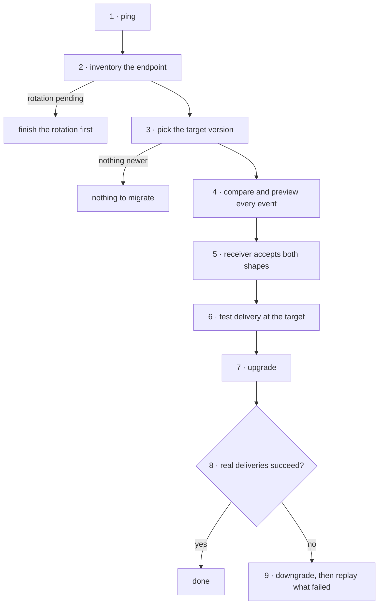

# Webhook version migration

**Policy:** [`SAFETY.md`](../SAFETY.md) · **Safety layer:**
[`epd-mcp-operator`](../docs/epd-mcp-operator.md) · **Index:** [recipes](./README.md)

An endpoint moves to a newer webhook schema version without its receiver ever
getting a payload shape it cannot parse — and with a tested way back.

**Read this first: it cannot be rehearsed today.** The sandbox account exposes
one webhook schema version, `2026-02-10`, marked current and latest, so there is
nothing to migrate to. The guard rails around a migration were all measured —
every refusal below is real — but the migration itself is written from the
tools' contracts. Re-run it against sandbox when a second version appears,
before anyone runs it live.

## Outcome

- Every endpoint that needs moving is identified, with its current version, its
  events, and any sunset date written as a date.
- For every event the endpoint subscribes to, what changes between the two
  versions is known and was reviewed by whoever owns the receiver.
- The receiver accepts both shapes before the switch, not after.
- The endpoint reads the target version, and real deliveries at that version
  succeed.
- If they did not, it was rolled back by downgrading, and the deliveries that
  failed in between were replayed on purpose, one by one.

**Not in this recipe.** The account's **API** version is a different line:
`ping` reports it, `upgrade_account_api_version` changes it, and that change is
T3 and one-way. On this account the API is `2026-02-11` and the webhook schema
`2026-02-10`. Receiver code — signature checks, parsing — is
[`epd-webhooks`](../docs/epd-webhooks.md).

## Before you start

| Input | Why it matters |
|---|---|
| Which endpoint, or "all of them" | Versions are per endpoint. |
| The target version | Read from `list_webhook_versions`, never typed from memory. |
| Who owns the receiver, and that they are available | Step 5 is their change, and step 8 needs them watching. |
| When real traffic will arrive after the switch | Step 8 has nothing to read until it does. |

## The chain



| # | Step | Skill | Tools | Tier | Checkpoint |
|---|---|---|---|---|---|
| 1 | Establish the mode | operator | `ping` | T0 | mode stated |
| 2 | Inventory the endpoint | webhook-ops | `list_webhook_endpoints`, `get_webhook_endpoint` | T0 | version, events, sunset, no rotation pending |
| 3 | Pick the target | webhook-ops | `list_webhook_versions` | T0 | target exists and is newer |
| 4 | Compare and preview | webhook-ops | `list_webhook_events`, `compare_webhook_versions`, `preview_webhook_payload` | T0 | every event compared and reviewed |
| 5 | Update the receiver | webhooks | — | — | the receiver accepts both shapes |
| 6 | Test at the target | webhook-ops | `test_webhook_endpoint`, `list_webhook_delivery_logs` | T2 external | the test delivery was accepted |
| 7 | Upgrade | webhook-ops | `upgrade_webhook_version`, `get_webhook_endpoint` | T2 | the endpoint reads the target |
| 8 | Watch real traffic | webhook-ops | `list_webhook_delivery_logs` | T0 | deliveries at the target succeed |
| 9 | Roll back if needed | webhook-ops | `downgrade_webhook_version`, `replay_webhook_event` | T2 | old version restored, failed events replayed |

## Steps

### 1. Establish the mode

**Skill:** [`epd-mcp-operator`](../docs/epd-mcp-operator.md) · **Tier:** T0

```
tool: ping
input: {}
```

**Checkpoint.** Mode stated. Test and live endpoints are separate objects with
separate versions; migrating one does nothing to the other. Note `api_version`
here and do not confuse it with the webhook version in step 2.

**If it fails**

| Condition | What it means | Do |
|---|---|---|
| Live mode, and this is the first migration to this version | Nobody has rehearsed it | Stop and run the recipe in test mode first. |

### 2. Inventory the endpoint

**Skill:** [`epd-webhook-ops`](../docs/epd-webhook-ops.md) · **Tier:** T0

```
tool: list_webhook_endpoints
input:
  limit: 100
```

```
tool: get_webhook_endpoint
input:
  id: <step 2: endpoint.id>
```

**Checkpoint.** For each endpoint in scope, quote: `url`, `status`,
`api_version`, `api_version_pinned_at`, `api_version_deprecated`,
`api_version_sunset` — as a date, since a sunset is a scheduled outage —
`enabled_events`, and `has_pending_rotation`, which must be `false`.

**If it fails**

| Condition | What it means | Do |
|---|---|---|
| `has_pending_rotation: true` | A secret rotation is inside its 24-hour window | Wait for it to finish. Two changes at once make any failure ambiguous. |
| `status: "disabled"` | Nothing is delivered to it | Migrating it is harmless, but step 8 will have nothing to read. |
| `api_version_sunset` is set | The current version has an end date | That date is the deadline for this recipe. |

### 3. Pick the target version

**Skill:** [`epd-webhook-ops`](../docs/epd-webhook-ops.md) · **Tier:** T0

```
tool: list_webhook_versions
input: {}
```

**Checkpoint.** The target appears in the list, is newer than the endpoint's
`api_version`, and is not itself deprecated or sunset. Read its `changelog`: it
names each added or changed field and the resource it belongs to. The one entry
on this account adds `order.recovery`, whose payload the changelog says includes
customer contact information and card details — a receiver that logs raw
payloads should know that before subscribing.

**If it fails**

| Condition | What it means | Do |
|---|---|---|
| One version, the endpoint's own | Nothing to migrate to — the sandbox today | Stop. |
| The target is not listed | It does not exist on this account | Stop. `upgrade_webhook_version` would return `invalid_webhook_version`. |

### 4. Compare and preview every subscribed event

**Skill:** [`epd-webhook-ops`](../docs/epd-webhook-ops.md) · **Tier:** T0

Start from the events that actually arrive, not only the subscription list —
`enabled_events` is not validated, so a misspelled name sits there looking
subscribed:

```
tool: list_webhook_events
input:
  id: <step 2: endpoint.id>
  limit: 100
```

Then, for **each** event type:

```
tool: compare_webhook_versions
input:
  event_type: <step 2: one of enabled_events>
  from_version: <step 2: endpoint.api_version>
  to_version: <step 3: target version>
```

```
tool: preview_webhook_payload
input:
  event_type: <step 2: one of enabled_events>
  version: <step 3: target version>
```

**Checkpoint.** A `compare_webhook_versions` result for every event type, with
its `changes` reviewed by the receiver's owner, and each preview payload handed
to them as a test fixture. An empty `changes` list is a real answer: that event
does not change.

`preview_webhook_payload` does not validate the event name. Measured: it
accepted `order.suceeded` and returned a generic sample. A preview that works
proves nothing about the name; step 4's `list_webhook_events` does.

**If it fails**

| Condition | What it means | Do |
|---|---|---|
| `invalid_webhook_version` | A version that does not exist — measured | Back to step 3. |
| A subscribed event never appears in `list_webhook_events` | Misspelled, or nothing of that type has happened | Check the name with the receiver's owner before migrating. |
| `changes` removes or renames a field the receiver reads | A breaking change | Step 5 must handle it before anything else. |

### 5. Update the receiver to accept both shapes

**Skill:** [`epd-webhooks`](../docs/epd-webhooks.md) · **Tier:** no call — this is
the merchant's code

The receiver must parse the **current and the target** shape before the switch,
and keep doing so for a while after it. Nothing on this surface says which
version an automatic retry or a replay of an older event carries, so both shapes
can arrive during the changeover.

**Checkpoint.** The receiver's owner confirms it is deployed and passes against
the step 4 fixtures in both versions.

**If it fails**

| Condition | What it means | Do |
|---|---|---|
| Not deployed yet | The switch would break the receiver | Stop here. Nothing has changed on the account. |

### 6. Test delivery at the target version

**Skill:** [`epd-webhook-ops`](../docs/epd-webhook-ops.md) · **Tier:** T2 external

This sends a real HTTP request from EPD to the receiver. It has no idempotency
key, so a repeat is a second delivery.

> I'm about to call **`test_webhook_endpoint`** on **<URL>** (`<step 2:
> endpoint.id>`) with event **<type>** at schema version **<target>**, in
> **<mode>**. This sends one real request to that URL. Proceed?

```
tool: test_webhook_endpoint
input:
  id: <step 2: endpoint.id>
  event_type: <step 2: one of enabled_events>
  api_version: <step 3: target version>
```

```
tool: list_webhook_delivery_logs
input:
  id: <step 2: endpoint.id>
  limit: 10
```

**Checkpoint.** The test delivery is logged and the receiver accepted it.

**If it fails**

| Condition | What it means | Do |
|---|---|---|
| Timeout | Unknown whether it was sent | **Do not resend.** Read the delivery log. |
| Receiver rejected it | It does not yet accept the target shape | Back to step 5. |

### 7. Upgrade

**Skill:** [`epd-webhook-ops`](../docs/epd-webhook-ops.md) · **Tier:** T2 — no
idempotency key

> I'm about to call **`upgrade_webhook_version`** on **<URL>** (`<step 2:
> endpoint.id>`) from **<current>** to **<target>**, in **<mode>**. Deliveries
> after this use the new shape. Proceed?

```
tool: upgrade_webhook_version
input:
  id: <step 2: endpoint.id>
  version: <step 3: target version>
```

```
tool: get_webhook_endpoint
input:
  id: <step 2: endpoint.id>
```

**Checkpoint.** `api_version` reads the target.

**If it fails**

| Condition | What it means | Do |
|---|---|---|
| `invalid_version_upgrade`, "must be newer than current version" | The target is not newer — measured | Nothing to do; re-check step 3. |
| `invalid_webhook_version` | The version does not exist — measured | Back to step 3. |
| Timeout | Unknown | **Do not retry.** `get_webhook_endpoint` shows whether it landed. |

### 8. Watch real deliveries

**Skill:** [`epd-webhook-ops`](../docs/epd-webhook-ops.md) · **Tier:** T0

Once real traffic has had time to arrive:

```
tool: list_webhook_delivery_logs
input:
  id: <step 2: endpoint.id>
  limit: 100
```

**Checkpoint.** Deliveries after the upgrade succeed, for each subscribed event
type that has occurred. Keep watching until every type the receiver depends on
has been seen at least once.

**If it fails**

| Condition | What it means | Do |
|---|---|---|
| Deliveries failing since the upgrade | The receiver cannot handle the new shape | Step 9 now, then fix the receiver. |
| Failing for another reason — signature, timeouts | Not the version | [`epd-webhooks`](../docs/epd-webhooks.md). A rollback will not help. |
| No deliveries at all | No traffic yet, or event names wrong | Wait, or check names against step 4. |

### 9. Roll back if needed

**Skill:** [`epd-webhook-ops`](../docs/epd-webhook-ops.md) · **Tier:** T2

The way back is a downgrade. There is **no pause**: `update_webhook_endpoint`
with `disabled: true` returns success and leaves the endpoint `enabled` —
measured twice. Deleting the endpoint is T3, final, and destroys the delivery
history you need for the next part.

> I'm about to call **`downgrade_webhook_version`** on **<URL>** (`<step 2:
> endpoint.id>`) from **<target>** back to **<previous>**, in **<mode>**.
> Proceed?

```
tool: downgrade_webhook_version
input:
  id: <step 2: endpoint.id>
  version: <step 2: endpoint.api_version before the upgrade>
```

Then read the delivery log for events that failed between the upgrade and the
downgrade, and replay each one the receiver still needs. Every replay is a real
second delivery, confirmed on its own, and never retried on a timeout. Whether
the receiver tolerates a duplicate is its owner's knowledge, not yours — ask.

> I'm about to call **`replay_webhook_event`** for event `<step 9: event id>`
> (**<type>**, first sent **<time>**) to **<URL>**, in **<mode>**. It delivers the
> event again. Proceed?

```
tool: replay_webhook_event
input:
  endpoint_id: <step 2: endpoint.id>
  event_id: <step 9: failed event id from the delivery log>
```

**Checkpoint.** `api_version` reads the previous version, new deliveries
succeed, and every failed event is accounted for as replayed or deliberately
skipped.

**If it fails**

| Condition | What it means | Do |
|---|---|---|
| `invalid_version_downgrade`, "must be older than current version" | The target is not older — measured | Check what the endpoint reads now. |
| Replay timeout | Unknown whether it was delivered | **Do not resend.** Read the delivery log. |

## Where it can stop

| Stopped after | The account holds | Resume or clean up |
|---|---|---|
| 2–5 | Nothing changed — reads and code only | Resume anywhere. |
| 6 | One test delivery sent | Harmless if the receiver handled it. |
| 7, before 8 | The endpoint on the new version, unwatched | Watch now. This is the stop state that turns into an outage. |
| 8, failing | A receiver dropping events | Step 9 at once. |
| 9, downgraded, not replayed | Events lost in the gap | Replay them; the delivery log lists them. |

## Running it unattended

It does not. `test_webhook_endpoint` and `replay_webhook_event` send traffic to
an external URL, and the upgrade and downgrade change what a live receiver gets;
all are T2 with no standing authorization. Steps 2–4 are T0, and a scheduled job
running them is useful: it can notice an `api_version_sunset` date appearing and
report it long before the deadline.

## What was verified

Measured against the EPD sandbox on **28 September 2026**, on a probe endpoint
created for the purpose, subscribed to an event nothing in the session triggered,
and deleted afterwards. Its delivery log stayed empty throughout.

| Step | Measured |
|---|---|
| 2 | A new endpoint reads `api_version: "2026-02-10"`, `api_version_pinned_at: null`, `api_version_deprecated: false`, `api_version_sunset: null` |
| 3 | `list_webhook_versions` returns one version: `2026-02-10`, `status: "current"`, `is_latest: true`, `sunset_date: null` |
| 4 | `preview_webhook_payload` for `order.succeeded` returns `api_version`, `event_type` and a `payload` with `id`, `type`, `created`, `api_version` and `data.object`. It accepts `order.suceeded` too. `compare_webhook_versions` from a version to itself returns `changes: []`; from a version that does not exist, `invalid_webhook_version` |
| 7 | Upgrade to the current version: `invalid_version_upgrade`. Upgrade to `2027-01-01`: `invalid_webhook_version` |
| 9 | Downgrade to the current version: `invalid_version_downgrade`. Downgrade to `2025-06-01`: `invalid_webhook_version`. `update_webhook_endpoint` with `disabled: true`, with and without an idempotency key: success, `status` still `enabled` — while a `description` change through the same tool applied |

**Not verified:** a real upgrade and downgrade, since there is no second
version; `test_webhook_endpoint` and `replay_webhook_event`, which would have
sent real requests to a third-party URL with no receiver of ours behind it; and
which version a replay of an older event carries.
