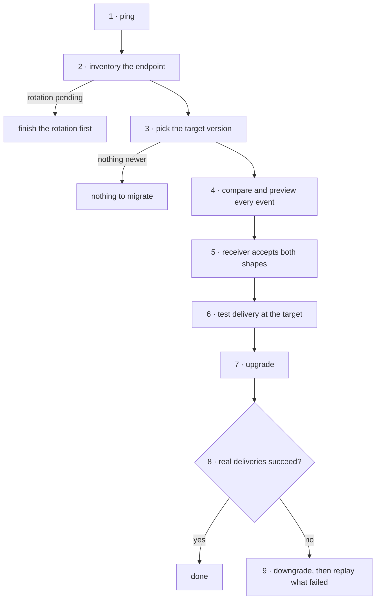

# Webhook version migration

**Policy:** [`SAFETY.md`](../SAFETY.md) · **Safety layer:**
[`epd-mcp-operator`](../docs/epd-mcp-operator.md) · **Index:** [recipes](./README.md)

An endpoint moves to a newer webhook schema version without its receiver ever
getting a payload shape it cannot parse — and with a tested way back.

**Read this first: it cannot be rehearsed today.** The sandbox account exposes
one webhook schema version, `2026-02-10`, marked current and latest, so there is
nothing to migrate to. The guard rails around a migration were all measured —
every refusal below is real — but the migration itself is written from the
tools' contracts. Re-run it against sandbox when a second version appears,
before anyone runs it live.

## Outcome

- Every endpoint that needs moving is identified, with its current version, its
  events, and any sunset date written as a date.
- For every event the endpoint subscribes to, what changes between the two
  versions is known and was reviewed by whoever owns the receiver.
- The receiver accepts both shapes before the switch, not after.
- The endpoint reads the target version, and real deliveries at that version
  succeed.
- If they did not, it was rolled back by downgrading, and the deliveries that
  failed in between were replayed on purpose, one by one.

**Not in this recipe.** The account's **API** version is a different line:
`ping` reports it, `upgrade_account_api_version` changes it, and that change is
T3 and one-way. On this account `ping` reads `api_version: null` — not pinned —
with `latest_api_version: "2026-02-11"`, while the webhook schema is
`2026-02-10`. Receiver code — signature checks, parsing — is
[`epd-webhooks`](../docs/epd-webhooks.md).

## Before you start

| Input | Why it matters |
|---|---|
| Which endpoint, or "all of them" | Versions are per endpoint. |
| The target version | Read from `list_webhook_versions`, never typed from memory. |
| Who owns the receiver, and that they are available | Step 5 is their change, and step 8 needs them watching. |
| When real traffic will arrive after the switch | Step 8 has nothing to read until it does. |

## The chain



| # | Step | Skill | Tools | Tier | Checkpoint |
|---|---|---|---|---|---|
| 1 | Establish the mode | operator | `ping` | T0 | mode stated |
| 2 | Inventory the endpoint | webhook-ops | `list_webhook_endpoints`, `get_webhook_endpoint` | T0 | version, events, sunset, no rotation pending |
| 3 | Pick the target | webhook-ops | `list_webhook_versions` | T0 | target exists and is newer |
| 4 | Compare and preview | webhook-ops | `list_webhook_events`, `compare_webhook_versions`, `preview_webhook_payload` | T0 | every event compared and reviewed |
| 5 | Update the receiver | webhooks | — | — | the receiver accepts both shapes |
| 6 | Test at the target | webhook-ops | `test_webhook_endpoint`, `list_webhook_delivery_logs` | T2 external | the test delivery was accepted |
| 7 | Upgrade | webhook-ops | `upgrade_webhook_version`, `get_webhook_endpoint` | T2 | the endpoint reads the target |
| 8 | Watch real traffic | webhook-ops | `list_webhook_events`, `list_webhook_delivery_logs` | T0 | deliveries at the target succeed |
| 9 | Roll back if needed | webhook-ops | `downgrade_webhook_version`, `list_webhook_events`, `replay_webhook_event` | T2 | old version restored, failed events replayed |

## Steps

### 1. Establish the mode

**Skill:** [`epd-mcp-operator`](../docs/epd-mcp-operator.md) · **Tier:** T0

```
tool: ping
input: {}
```

**Checkpoint.** Mode stated. Test and live endpoints are separate objects with
separate versions; migrating one does nothing to the other. `ping`'s
`api_version` and `latest_api_version` are the account's API line — `null`
means unpinned — and are not the webhook version in step 2.

**If it fails**

| Condition | What it means | Do |
|---|---|---|
| Live mode, and this is the first migration to this version | Nobody has rehearsed it | Stop and run the recipe in test mode first. |

### 2. Inventory the endpoint

**Skill:** [`epd-webhook-ops`](../docs/epd-webhook-ops.md) · **Tier:** T0

```
tool: list_webhook_endpoints
input:
  limit: 100
```

```
tool: get_webhook_endpoint
input:
  id: <step 2: endpoint.id>
```

**Checkpoint.** For each endpoint in scope, quote: `url`, `status`,
`api_version`, `api_version_pinned_at`, `api_version_deprecated`,
`api_version_sunset` — as a date, since a sunset is a scheduled outage —
`enabled_events`, and `has_pending_rotation`, which must be `false`.

**If it fails**

| Condition | What it means | Do |
|---|---|---|
| `has_pending_rotation: true` | A secret rotation is inside its 24-hour window | Wait for it to finish. Two changes at once make any failure ambiguous. |
| `status: "disabled"` | Nothing is delivered to it | Migrating it is harmless, but step 8 will have nothing to read. |
| `api_version_sunset` is set | The current version has an end date | That date is the deadline for this recipe. |

### 3. Pick the target version

**Skill:** [`epd-webhook-ops`](../docs/epd-webhook-ops.md) · **Tier:** T0

```
tool: list_webhook_versions
input: {}
```

**Checkpoint.** The target appears in the list, is newer than the endpoint's
`api_version`, and is not itself deprecated or sunset. Read its `changelog`: it
names each added or changed field and the resource it belongs to. The one entry
on this account adds `order.recovery`, whose payload the changelog says includes
customer contact information and card details — a receiver that logs raw
payloads should know that before subscribing.

**If it fails**

| Condition | What it means | Do |
|---|---|---|
| One version, the endpoint's own | Nothing to migrate to — the sandbox today | Stop. |
| The target is not listed | It does not exist on this account | Stop. `upgrade_webhook_version` would return `invalid_webhook_version`. |

### 4. Compare and preview every subscribed event

**Skill:** [`epd-webhook-ops`](../docs/epd-webhook-ops.md) · **Tier:** T0

Start from the events that actually arrive, not only the subscription list —
`enabled_events` is not validated, so a misspelled name sits there looking
subscribed:

```
tool: list_webhook_events
input:
  id: <step 2: endpoint.id>
  limit: 100
```

Then, for **each** event type:

```
tool: compare_webhook_versions
input:
  event_type: <step 2: one of enabled_events>
  from_version: <step 2: endpoint.api_version>
  to_version: <step 3: target version>
```

```
tool: preview_webhook_payload
input:
  event_type: <step 2: one of enabled_events>
  version: <step 3: target version>
```

**Checkpoint.** A `compare_webhook_versions` result for every event type, with
its `changes` reviewed by the receiver's owner, and each preview payload handed
to them as a test fixture. An empty `changes` list is a real answer: that event
does not change.

`preview_webhook_payload` does not validate the event name. Measured: it
accepted `order.suceeded` and returned a generic sample. A preview that works
proves nothing about the name; step 4's `list_webhook_events` does.

**If it fails**

| Condition | What it means | Do |
|---|---|---|
| `invalid_webhook_version` | A version that does not exist — measured | Back to step 3. |
| A subscribed event never appears in `list_webhook_events` | Misspelled, or nothing of that type has happened | Check the name with the receiver's owner before migrating. |
| `changes` removes or renames a field the receiver reads | A breaking change | Step 5 must handle it before anything else. |

### 5. Update the receiver to accept both shapes

**Skill:** [`epd-webhooks`](../docs/epd-webhooks.md) · **Tier:** no call — this is
the merchant's code

The receiver must parse the **current and the target** shape before the switch,
and keep doing so for a while after it. Nothing says in advance which version
an automatic retry or a replay of an older event carries — a replay's result
reports it only after it was sent — so both shapes can arrive during the
changeover.

**Checkpoint.** The receiver's owner confirms it is deployed and passes against
the step 4 fixtures in both versions.

**If it fails**

| Condition | What it means | Do |
|---|---|---|
| Not deployed yet | The switch would break the receiver | Stop here. Nothing has changed on the account. |

### 6. Test delivery at the target version

**Skill:** [`epd-webhook-ops`](../docs/epd-webhook-ops.md) · **Tier:** T2 external

This sends a real HTTP request from EPD to the receiver. It has no idempotency
key, so a repeat is a second delivery.

> I'm about to call **`test_webhook_endpoint`** on **<URL>** (`<step 2:
> endpoint.id>`) with event **<type>** at schema version **<target>**, in
> **<mode>**. This sends one real request to that URL. Proceed?

```
tool: test_webhook_endpoint
input:
  id: <step 2: endpoint.id>
  event_type: <step 2: one of enabled_events>
  api_version: <step 3: target version>
```

```
tool: list_webhook_delivery_logs
input:
  id: <step 2: endpoint.id>
  limit: 10
```

**Checkpoint.** The test delivery is logged and the receiver accepted it.

**If it fails**

| Condition | What it means | Do |
|---|---|---|
| Timeout | Unknown whether it was sent | **Do not resend.** Read the delivery log. |
| Receiver rejected it | It does not yet accept the target shape | Back to step 5. |
| `invalid_url`, "points to an internal or private network address" | EPD will not send to this host — measured | The URL is the problem, not the version. Every real event to it is dead-lettered too; see [`epd-webhook-ops`](../docs/epd-webhook-ops.md). |
| `invalid_webhook_version` | `api_version` names a version that does not exist — measured | Back to step 3. |

### 7. Upgrade

**Skill:** [`epd-webhook-ops`](../docs/epd-webhook-ops.md) · **Tier:** T2 — no
idempotency key

> I'm about to call **`upgrade_webhook_version`** on **<URL>** (`<step 2:
> endpoint.id>`) from **<current>** to **<target>**, in **<mode>**. Deliveries
> after this use the new shape. Proceed?

```
tool: upgrade_webhook_version
input:
  id: <step 2: endpoint.id>
  version: <step 3: target version>
```

```
tool: get_webhook_endpoint
input:
  id: <step 2: endpoint.id>
```

**Checkpoint.** `api_version` reads the target.

`update_webhook_endpoint` also accepts `api_version`, and so does
`create_webhook_endpoint`. Do not migrate through either: both refuse a version
that does not exist (`invalid_webhook_version`, measured), but only the upgrade
and downgrade tools state a direction, and whether `update` enforces one could
not be measured with a single version.

**If it fails**

| Condition | What it means | Do |
|---|---|---|
| `invalid_version_upgrade`, "must be newer than current version" | The target is not newer — measured | Nothing to do; re-check step 3. |
| `invalid_webhook_version` | The version does not exist — measured | Back to step 3. |
| Timeout | Unknown | **Do not retry.** `get_webhook_endpoint` shows whether it landed. |

### 8. Watch real deliveries

**Skill:** [`epd-webhook-ops`](../docs/epd-webhook-ops.md) · **Tier:** T0

Once real traffic has had time to arrive, read the events first — each carries
its own delivery state (`status`, `attempts`, `max_attempts`, `completed_at`) —
and then the log of attempts:

```
tool: list_webhook_events
input:
  id: <step 2: endpoint.id>
  limit: 100
```

```
tool: list_webhook_delivery_logs
input:
  id: <step 2: endpoint.id>
  limit: 100
```

**Checkpoint.** Events created after the upgrade are delivered, for each
subscribed event type that has occurred. Keep watching until every type the
receiver depends on has been seen at least once.

**If it fails**

| Condition | What it means | Do |
|---|---|---|
| Deliveries failing since the upgrade | The receiver cannot handle the new shape | Step 9 now, then fix the receiver. |
| Failing for another reason — signature, timeouts | Not the version | [`epd-webhooks`](../docs/epd-webhooks.md). A rollback will not help. |
| No events at all | No traffic yet, or event names wrong | Wait, or check names against step 4. |
| Events `dead_letter` at `attempts: 0`, empty log | EPD never tried to send — the URL is not publicly reachable. Measured | Not the version. Fix the URL; a rollback will not help. |

### 9. Roll back if needed

**Skill:** [`epd-webhook-ops`](../docs/epd-webhook-ops.md) · **Tier:** T2

The way back is a downgrade. There is **no pause**: `update_webhook_endpoint`
with `disabled: true` returns success and leaves the endpoint `enabled` —
measured twice. Deleting the endpoint is T3, final, and destroys the delivery
history you need for the next part.

> I'm about to call **`downgrade_webhook_version`** on **<URL>** (`<step 2:
> endpoint.id>`) from **<target>** back to **<previous>**, in **<mode>**.
> Proceed?

```
tool: downgrade_webhook_version
input:
  id: <step 2: endpoint.id>
  version: <step 2: endpoint.api_version before the upgrade>
```

Then list the events that failed between the upgrade and the downgrade. Read
them from the events list, not the delivery log: the event `id` there is what
`replay_webhook_event` takes, and an event EPD never attempted has no log entry
at all.

```
tool: list_webhook_events
input:
  id: <step 2: endpoint.id>
  limit: 100
```

Replay each one the receiver still needs. Every replay is a real second
delivery, confirmed on its own, and never retried on a timeout. Whether the
receiver tolerates a duplicate is its owner's knowledge, not yours — ask.

> I'm about to call **`replay_webhook_event`** for event `<step 9: event id>`
> (**<type>**, first sent **<time>**) to **<URL>**, in **<mode>**. It delivers the
> event again. Proceed?

```
tool: replay_webhook_event
input:
  endpoint_id: <step 2: endpoint.id>
  event_id: <step 9: failed event id from list_webhook_events>
```

Read the replay's own result. It reports the delivery attempt — `status`,
`http_status_code`, `error_message`, and the `api_version` it was sent at — and
a replay that failed is **not** an error response. Measured: a replay to an
unreachable URL returned normally with `status: "failed"` and `error_message`
"URL points to internal/private address", and left the event `dead_letter` at
zero attempts with nothing logged.

**Checkpoint.** `api_version` reads the previous version, new deliveries
succeed, and every failed event is accounted for as replayed — its replay
result read, not assumed — or deliberately skipped.

**If it fails**

| Condition | What it means | Do |
|---|---|---|
| `invalid_version_downgrade`, "must be older than current version" | The target is not older — measured | Check what the endpoint reads now. |
| Replay returns `status: "failed"` | It was not delivered; the call itself succeeded — measured | Read `error_message`. Do not loop replays; fix the cause first. |
| `resource_not_found` on replay | The event id is not on this endpoint — measured | Take the id from `list_webhook_events` for this endpoint. |
| Replay timeout | Unknown whether it was delivered | **Do not resend.** Read the delivery log and the event's `attempts`. |

## Where it can stop

| Stopped after | The account holds | Resume or clean up |
|---|---|---|
| 2–5 | Nothing changed — reads and code only | Resume anywhere. |
| 6 | One test delivery sent | Harmless if the receiver handled it. |
| 7, before 8 | The endpoint on the new version, unwatched | Watch now. This is the stop state that turns into an outage. |
| 8, failing | A receiver dropping events | Step 9 at once. |
| 9, downgraded, not replayed | Events lost in the gap | Replay them; `list_webhook_events` lists them. |

## Running it unattended

It does not. `test_webhook_endpoint` and `replay_webhook_event` send traffic to
an external URL, and the upgrade and downgrade change what a live receiver gets;
all are T2 with no standing authorization. Steps 2–4 are T0, and a scheduled job
running them is useful: it can notice an `api_version_sunset` date appearing and
report it long before the deadline.

## What was verified

Measured against the EPD sandbox on **28 September 2026**, and run again as a
chain on **30 September** (35 calls). The second run used an endpoint on an
`.invalid` host, so nothing could reach a third party, subscribed to
`order.succeeded`, `order.refunded` and the misspelling `order.suceeded`. One
real test order was charged to produce an event, then refunded, and the
endpoint was deleted.

| Step | Measured |
|---|---|
| 1 | `ping` reads `api_version: null` and `latest_api_version: "2026-02-11"` — the account is not pinned |
| 2 | A new endpoint reads `api_version: "2026-02-10"`, `api_version_pinned_at: null`, `api_version_deprecated: false`, `api_version_sunset: null`, `has_pending_rotation: false`; `list_webhook_endpoints` carries the same fields. `order.suceeded` was accepted into `enabled_events` |
| 3 | `list_webhook_versions` returns one version: `2026-02-10`, `status: "current"`, `is_latest: true`, `sunset_date: null`, one changelog entry adding `order.recovery` — unchanged on 30 September |
| 4 | `preview_webhook_payload` for `order.succeeded` returns `api_version`, `event_type` and a `payload` with `id`, `type`, `created`, `api_version` and `data.object`. It accepts `order.suceeded` too; a version that does not exist is `invalid_webhook_version`. `compare_webhook_versions` from a version to itself returns `changes: []`, with both sample payloads; to a version that does not exist, `invalid_webhook_version`. A fresh endpoint's events list is empty, and the misspelled subscription never matched anything |
| 6 | `test_webhook_endpoint` to the `.invalid` host: `invalid_url`. At a version that does not exist: `invalid_webhook_version` |
| 7 | Upgrade to the current version: `invalid_version_upgrade`. Upgrade to `2027-01-01` or to `2025-01-01`: `invalid_webhook_version`. `update_webhook_endpoint` and `create_webhook_endpoint` with an `api_version` that does not exist: `invalid_webhook_version`, endpoint unchanged; `update` to the current version: success |
| 8 | The test order's `order.succeeded` event was recorded against the endpoint as `dead_letter`, `attempts: 0`, `max_attempts: 7`; the delivery log stayed empty |
| 9 | Downgrade to the current version: `invalid_version_downgrade`. Downgrade to `2025-06-01`: `invalid_webhook_version`. `update_webhook_endpoint` with `disabled: true`: success, `status` still `enabled`. `replay_webhook_event` of the dead-lettered event returned normally with `status: "failed"`, `api_version: "2026-02-10"`, `http_status_code: null` and an `error_message`; the event stayed `dead_letter` at zero attempts and nothing was logged. A replay of an event id that does not exist: `resource_not_found` |

**Not verified:** a real upgrade and downgrade, since there is still no second
version; a test delivery or replay that reached a receiver, which needs a public
URL of our own; and which version a replay of an event created before an upgrade
carries — the replay result reports it, but with one version it could only read
`2026-02-10`.
